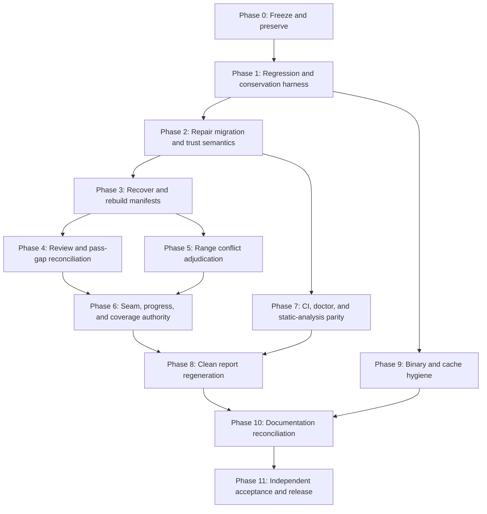

# Repository Remediation Corrective Action Implementation Plan

| Field | Value |
|---|---|
| Repository | Chrono Trigger Disassembly |
| Working branch | `live-work-from-pass166` |
| Original audit baseline | `253f2f6c75cd9b572bdc1fc25d6dcc0e8d148a59` |
| Remediation implementation under review | `d53cd365ed335047adcbb353ac83afb061816d5b` |
| Plan created | 2026-08-18 |
| Plan status | Proposed; corrective implementation has not started |
| Relationship to original plan | Corrective follow-up to `docs/plans/REPOSITORY_REMEDIATION_IMPLEMENTATION_PLAN.md` |
| Primary objective | Recover lost manifest evidence and make every repository health signal truthful, reproducible, and enforceable |

## 1. Executive summary

Commit `d53cd365` implemented much of the repository remediation architecture, but the resulting repository cannot yet be treated as a trustworthy canonical baseline. The most urgent defect is a non-idempotent manifest migration: after legacy files existed, rerunning the migration skipped active manifests whenever a legacy file shared the same pass number. Twenty-two original source manifests for passes 1000 through 1021 disappeared from the migration record and archive. Twenty ranges, totaling 613 source bytes, are no longer represented anywhere in the canonical range set.

The implementation also converted pending review states to reviewed, upgraded confidence without source evidence, marked every remaining range conflict and pass gap as reviewed using generic generated rationales, allowed contradictory live-seam state to pass strict branch auditing, reported a green doctor while the identical Pyflakes command failed in CI, produced reports from a dirty pre-commit worktree, and left tracked caches and binary archives that contradict the accepted artifact policy.

This plan repairs those problems in twelve ordered phases, numbered Phase 0 through Phase 11. The order is mandatory:

1. freeze destructive migration and preserve the defective-but-recoverable state;
2. add regression tests and machine-checkable conservation contracts;
3. repair migration, adapters, identity validation, and review semantics;
4. recover all 1,000 baseline source manifests and rebuild canonical manifests;
5. replace generated approvals with evidence-backed review records;
6. adjudicate range conflicts instead of hiding them with waivers;
7. establish one authoritative seam, progress, and coverage model;
8. make local checks, doctor, and CI use identical failure semantics;
9. regenerate reports with valid provenance and drift checks;
10. complete current-tree cache and binary hygiene, with history rewriting separately gated;
11. reconcile documentation and supersede inaccurate completion claims;
12. perform an independent final acceptance audit and cut a corrected baseline.

No phase may declare success merely because a command exits zero. Each phase has conservation checks, negative tests, required artifacts, and explicit exit criteria.

## 2. Current verified defect baseline

The corrective work starts from the following observed state at `d53cd365`.

| Area | Current observed state | Required corrected state |
|---|---:|---:|
| Baseline manifest candidates | 1,000 | All 1,000 represented exactly once in the source migration ledger |
| Migration records | 978 | 1,000 source records, each with path and SHA-256 |
| Unaccounted source manifests | 22 (`pass1000.json`–`pass1021.json`) | 0 |
| Source ranges absent globally | 20 ranges / 613 bytes | 0 without an explicit evidence-backed disposition |
| Canonical manifests | 961 | Expected to remain 961 unless adjudication proves otherwise |
| Range conflicts hidden by waivers | 170 | 0 generated approvals; all conflicts resolved or individually approved |
| Code/data conflicts among waivers | 20 | 0 unresolved; explicit mixed-content evidence for any retained exception |
| Intentional pass gaps | 106 bulk-marked reviewed | Every gap individually evidenced or returned to unreviewed status |
| Latest generated manifest seam | `C3:6800..` | One authoritative seam agreed by manifest, note, progress, and docs |
| Other documented seams | `C3:9800..`, `C3:D000.. / C4:A000..` | No contradictory current-state claims |
| Coverage claims | 1.40% and approximately 14.6% | Separately named metrics with explicit denominators |
| Unit tests | 21 passing | Expanded suite covers all corrective invariants |
| Pyflakes | Fails for `tools tests` | Zero findings for the exact CI scope |
| GitHub Actions | Failed at `d53cd365` | All required jobs green on all supported Python versions |
| Report provenance | Baseline commit plus dirty worktree | Clean input provenance and current manifest digest |
| Raw xref indexes tracked | 3 redundant copies | 0 tracked generated copies; one ignored canonical cache path |
| Toolkit ZIPs tracked | 81 | Removed or retained only through an explicit approved exception inventory |
| Emulator ZIPs tracked | 1 | Removed unless redistribution is explicitly approved and documented |
| Commercial ROM in current tree | Untracked/ignored | Remains untracked/ignored |
| Commercial ROM in reachable history | Present | Removed only through separately approved coordinated history cleanup |

The counts above are acceptance baselines, not estimates. If implementation discovers a different count, stop and produce a discrepancy report before changing data.

## 3. Scope

### 3.1 In scope

- Manifest discovery, migration, canonicalization, validation, and source conservation.
- Recovery of the missing pass 1000–1021 source manifests from Git object history.
- Review status, confidence, kind, and provenance semantics.
- Pass-gap evidence and validation.
- Range ownership conflict detection, adjudication, and waiver policy.
- Branch-state, continuation-note, seam, progress, and coverage consistency.
- Pyflakes cleanup, doctor behavior, test coverage, and CI parity.
- Generated-report provenance and deterministic drift checking.
- Current-tree cleanup for xref caches, toolkit archives, emulator archives, and ROM safeguards.
- Reconciliation of repository status documentation and completion reports.
- A separately gated procedure for removing prohibited ROM bytes from Git history.

### 3.2 Out of scope without additional authorization

- Reinterpreting game logic to increase coverage.
- Promoting pending functions or ranges based only on migration heuristics.
- Publishing archives, binaries, or ROM-derived artifacts to an external service.
- Force-pushing rewritten Git history.
- Deleting the only copy of any historical source or toolkit before its hash, provenance, and recovery location are verified.
- Relabeling established game semantics for style-only reasons.

## 4. Hard invariants

These invariants are blocking. They must be encoded as tests or strict validators, not left as prose.

### 4.1 Source conservation

1. Every one of the 1,000 baseline manifest candidate files must appear exactly once in the migration ledger.
2. Every ledger entry must record original path, original filename, original SHA-256, detected schema, parsed pass identity, canonical target, and disposition.
3. A source may be archived, merged, superseded, or quarantined, but it may not disappear.
4. Re-running migration over an already migrated tree must not change source count, canonical content, migration ledger content, or manifest-set digest.
5. Source identity is path plus content hash, not pass number alone.

### 4.2 Range conservation

1. Every normalized baseline range must appear in the post-migration range ledger.
2. A range may be active, merged as an exact duplicate, split, superseded, or rejected as invalid.
3. Any non-active disposition must include the original range, pass, source hash, reason, evidence reference, reviewer, and review timestamp.
4. Range conservation compares source records before interval union. Union-based coverage is not proof of migration completeness.
5. The 20 currently absent ranges and the two already duplicated elsewhere must all receive explicit source-level dispositions.

### 4.3 Review integrity

1. Migration may preserve trust; it may never increase trust.
2. `pending_final_review`, missing review status, or unknown review status must not become `reviewed` automatically.
3. Numeric candidate score is evidence, not a confidence level. Score 6 does not imply high confidence.
4. A merged manifest receives the least-trusted status of its active sources unless a separate adjudication record promotes it.
5. `reviewed: true` alone is not sufficient evidence for gaps or waivers.

### 4.4 Validation integrity

1. Strict mode must fail on parse errors, unknown schemas, identity mismatches, unreviewed gaps, unresolved conflicts, stale generated state, and failed subprocesses.
2. A validator may not silently swallow an exception.
3. Doctor and CI must evaluate the same command scope and return-code semantics.
4. Generated candidate decisions and approved decisions must be stored separately.

### 4.5 Reproducibility

1. Generated reports must identify the exact canonical manifest digest and generator version.
2. Report generation must begin from a clean input state.
3. CI must regenerate reports into a temporary directory and compare deterministic payloads.
4. No checked-in report may claim that a dirty input tree was clean.

## 5. Program dependency map



The critical path is `P0 → P1 → P2 → P3 → P4/P5 → P6 → P8 → P10 → P11`. Phase 7 may proceed after the regression harness exists. Current-tree cache cleanup may proceed in parallel after Phase 1, but history rewriting must remain separately approved.

### 5.1 Audit-finding traceability

| Corrective audit finding | Primary phases | Final proof |
|---|---|---|
| Migration omitted 22 source files and 20 ranges / 613 bytes | 0, 1, 2, 3 | 1,000-entry source ledger, zero-loss range ledger, idempotent rerun |
| Adapters fabricated reviewed/high-confidence state | 1, 2, 4 | Zero unexplained trust promotions; pass 1228/1229 regression tests |
| 170 conflicts and 106 gaps were bulk-approved | 1, 2, 4, 5 | Candidate/approval separation and evidence-complete registries |
| CI failed while completion report and doctor claimed success | 1, 7 | Exact-scope Pyflakes pass, shared acceptance runner, green CI |
| Seam/progress/coverage documentation contradicted itself | 1, 6, 10 | Strict agreement test across manifest, note, progress, and docs |
| Generated reports had stale dirty provenance | 1, 8 | Clean source provenance, current manifest digest, drift check |
| Tracked xref caches and archives violated policy | 1, 9 | Tracked-file policy check and reviewed archive disposition ledger |
| Completion report overstated acceptance | 0, 10, 11 | Superseded notice and independently verified corrective report |

## 6. Execution and change-control rules

### 6.1 Branching and commit discipline

- Perform corrective work on a dedicated branch from `d53cd365`.
- Do not rerun `migrate_manifests.py --apply` before Phase 2 exits.
- Keep code/test changes separate from bulk manifest data changes.
- Use one report-only commit when regenerating tracked reports so input provenance is unambiguous.
- Never mix Git history rewriting with normal corrective commits.
- Require a clean worktree at every phase entry and record the phase-entry commit.

### 6.2 Required phase evidence

Every phase PR or commit series must include:

- before/after machine-readable metrics;
- commands executed and exit codes;
- tests added or updated;
- generated files changed;
- unresolved decisions and owner;
- rollback point;
- explicit statement that no source evidence was deleted, or a reviewed deletion ledger if deletion was intended.

### 6.3 Stop conditions

Stop implementation and investigate if any of the following occurs:

- baseline source count differs from 1,000;
- a baseline source cannot be recovered from commit `253f2f6c`;
- post-migration range conservation loses any range without disposition;
- a second migration changes canonical output;
- a conflict count decreases only because entries were auto-waived;
- coverage changes before a corresponding source/range ledger change explains it;
- a generated report has dirty input provenance;
- a cleanup target lacks a verified recovery path.

### 6.4 Planning estimates and accountable roles

These are planning ranges, not deadlines. Conflict and gap review duration depends on evidence quality.

| Phase | Indicative effort | Primary implementer | Required reviewer |
|---|---:|---|---|
| 0 — Freeze and preserve | 0.5–1 day | Repository maintainer | Data/migration reviewer |
| 1 — Regression harness | 2–4 days | Python/tooling engineer | Test reviewer |
| 2 — Migration and trust repair | 3–5 days | Python/tooling engineer | Migration/data reviewer |
| 3 — Source recovery/rebuild | 2–4 days | Migration owner | Independent source-conservation reviewer |
| 4 — Trust and gap reconciliation | 3–8 days | Reverse-engineering maintainer | Evidence reviewer |
| 5 — Conflict adjudication | 1–3 weeks | Reverse-engineering reviewers | Second reviewer for code/data exceptions |
| 6 — Seam/progress/coverage | 2–4 days | Tooling plus project-state owner | Coverage reviewer |
| 7 — CI/doctor/static analysis | 1–3 days | Python/CI engineer | CI reviewer |
| 8 — Report provenance | 2–3 days | Tooling engineer | Reproducibility reviewer |
| 9 — Binary/cache hygiene | 2–5 days | Repository maintainer | Licensing/provenance reviewer |
| 10 — Documentation | 1–2 days | Maintainer/technical writer | State owner |
| 11 — Independent acceptance | 1–2 days | Independent reviewer | Maintainer sign-off |

No person should self-approve code/data mixed-content waivers, destructive archive removals, or history rewriting.

## 7. Phase 0 — Freeze destructive paths and preserve recovery evidence

### Objective

Prevent further data loss and establish an immutable recovery point for both the original baseline and the defective remediation state.

### Tasks

- [ ] Add a prominent temporary guard to the contributor/remediation runbook: do not use `migrate_manifests.py --apply` until the idempotency fix is merged.
- [ ] Record the following commits in a corrective baseline artifact:
  - original pre-remediation baseline `253f2f6c75cd9b572bdc1fc25d6dcc0e8d148a59`;
  - defective remediation commit `d53cd365ed335047adcbb353ac83afb061816d5b`.
- [ ] Generate a baseline source inventory directly from the original Git tree, not the current filesystem.
- [ ] Record all 1,000 manifest paths and Git blob IDs from the baseline tree.
- [ ] Record the current 978-entry migration ledger and 961 canonical manifest hashes.
- [ ] Record the 22 omitted source filenames and the 20 globally absent ranges in a corrective discrepancy artifact.
- [ ] Save the failed GitHub Actions run URL and exact failed command in the corrective status report.
- [ ] Create a local recovery bundle or maintainer-approved archival reference that contains both commits.
- [ ] Verify the recovery reference can read all 22 omitted files without checking the ROM into a new location.
- [ ] Mark `reports/remediation/remediation_completion_report.md` as historically superseded through an addendum; do not delete it.

### New artifacts

- `reports/remediation/corrective_baseline.json`
- `reports/remediation/manifest_source_discrepancy.json`
- `reports/remediation/corrective_status.md`

### Required discrepancy schema

Each missing source entry should contain:

```json
{
  "baseline_commit": "253f2f6c75cd9b572bdc1fc25d6dcc0e8d148a59",
  "source_path": "passes/manifests/pass1000.json",
  "source_blob": "<git-blob-id>",
  "source_sha256": "<sha256>",
  "pass_number": 1000,
  "normalized_ranges": ["C0:3D52..C0:3DA8"],
  "current_disposition": "missing_from_migration_ledger",
  "recovery_status": "recoverable_from_git"
}
```

### Validation

```powershell
git status --short
git cat-file -e 253f2f6c75cd9b572bdc1fc25d6dcc0e8d148a59^{commit}
git cat-file -e d53cd365ed335047adcbb353ac83afb061816d5b^{commit}
git ls-tree -r --name-only 253f2f6c75cd9b572bdc1fc25d6dcc0e8d148a59 -- passes/manifests
```

### Exit criteria

- The original 1,000-source baseline is independently enumerable.
- All 22 omitted files are recoverable and hashed.
- No migration or manifest data mutation occurred during the phase.
- The inaccurate completion report is clearly marked as superseded by corrective work.

### Rollback

This phase is additive. Revert only the new inventory/status commit; never delete the recovery bundle until final acceptance.

## 8. Phase 1 — Build the regression, conservation, and policy test harness

### Objective

Write failing tests for every audited defect before changing migration data or approval registries.

### 8.1 Migration fixture design

Create a compact fixture that reproduces the pass-identity collision:

- `pass1000.json` with range A;
- `pass1000_c3_session28.json` with range B;
- an existing `legacy/` directory containing the suffixed source;
- an existing canonical `pass1000.json` containing A and B;
- a migration ledger with both source hashes.

The fixture must test initial migration, migration over an already migrated tree, and a second identical rerun.

### 8.2 Required tests

- [ ] `test_migration_accounts_for_every_source_path_and_hash`.
- [ ] `test_migration_merges_same_pass_sources_instead_of_skipping_current_manifest`.
- [ ] `test_migration_is_idempotent_after_legacy_directory_exists`.
- [ ] `test_second_migration_preserves_manifest_set_digest`.
- [ ] `test_migration_range_inventory_is_conservative_before_union`.
- [ ] `test_filename_pass_must_equal_content_pass`.
- [ ] `test_pending_final_review_remains_pending`.
- [ ] `test_missing_verification_status_does_not_default_to_reviewed`.
- [ ] `test_numeric_score_does_not_raise_source_confidence`.
- [ ] `test_unknown_kind_is_rejected_or_explicitly_mapped`.
- [ ] `test_merged_manifest_uses_least_trusted_source_status`.
- [ ] `test_generated_conflict_candidates_are_not_active_waivers`.
- [ ] `test_unreviewed_or_incomplete_waiver_fails_strict_validation`.
- [ ] `test_gap_registry_requires_evidence_and_reviewer_metadata`.
- [ ] `test_gap_registry_parse_error_is_fatal_in_strict_mode`.
- [ ] `test_latest_manifest_requires_explicit_live_seam`.
- [ ] `test_continuation_note_without_seam_does_not_bypass_comparison`.
- [ ] `test_doctor_fails_on_nonzero_pyflakes_return_code`.
- [ ] `test_doctor_and_ci_use_same_static_analysis_scope`.
- [ ] `test_report_provenance_rejects_dirty_input`.
- [ ] `test_report_manifest_digest_matches_current_canonical_inputs`.
- [ ] `test_range_ownership_report_contains_provenance`.
- [ ] `test_tracked_generated_xref_cache_policy`.

### 8.3 Conservation tools

Complete `tools/scripts/compare_manifest_range_inventory.py` so it:

- reads both baseline and post-migration inventories;
- compares source path/hash identity;
- compares normalized source ranges before union;
- understands exact-duplicate source records without discarding provenance;
- emits `retained`, `merged_duplicate`, `split`, `superseded`, `invalid`, and `missing` dispositions;
- fails nonzero if any baseline source or range is missing without an approved disposition;
- writes JSON and Markdown reports;
- includes counts by pass, bank, schema, and disposition.

Add a separate source-ledger validator if keeping source and range checks in one script would make failure diagnostics unclear.

### 8.4 Policy schemas

Add JSON Schemas for:

- manifest migration ledger;
- source/range disposition ledger;
- active range-overlap waivers;
- generated range-conflict candidates;
- intentional pass-gap registry;
- generated report provenance.

The schemas must use `additionalProperties: false` for policy records so misspelled evidence fields cannot silently pass.

### Deliverables

- Expanded tests under `tests/`.
- Minimal collision/idempotency fixtures under `tests/fixtures/`.
- Completed conservation comparison tooling.
- Policy registry schemas under `tools/config/schemas/` or another documented canonical location.

### Validation

Before implementation fixes, the new defect tests should fail for the expected reasons. After each fix, they should pass without weakening assertions.

```powershell
python -m pytest -q
python -m pytest -q tests/test_manifest_migration.py
python -m pytest -q tests/test_review_integrity.py
python -m pytest -q tests/test_repository_policy.py
```

### Exit criteria

- Every finding from the corrective audit has at least one automated regression test.
- Conservation tools fail on the current 978/1,000 discrepancy.
- Tests distinguish a resolved record from a hidden or waived record.
- No production manifest has been rewritten yet.

## 9. Phase 2 — Repair migration, adapters, identity checks, and trust semantics

### Objective

Make migration idempotent and evidence-preserving before using it to recover production data.

### 9.1 Fix source discovery and deduplication

- [ ] Remove pass-number-wide suppression based on `seen_passes_in_legacy`.
- [ ] Discover canonical and legacy candidates independently.
- [ ] Assign each candidate a stable source key composed of original path and SHA-256.
- [ ] Deduplicate only identical source keys or explicitly recorded archive aliases.
- [ ] Group candidates by validated content pass number only after every source is in the ledger.
- [ ] Reject filename/content pass mismatch rather than selecting one identity silently.
- [ ] Keep the canonical output from being re-ingested as a new historical source on rerun.
- [ ] Recognize an existing migration ledger and use it to map archived original paths to current archive paths.
- [ ] Fail if two different bytes claim the same original source identity.
- [ ] Sort all output deterministically by pass, original source path, range, and label.

### 9.2 Make migration transactional

Refactor migration into explicit stages:

1. discover and hash without writes;
2. normalize into an in-memory plan;
3. validate source and range conservation;
4. write proposed output to a temporary staging directory;
5. validate staged canonical manifests and ledgers;
6. compare staged output to current output;
7. replace destination files only after all checks pass;
8. preserve a rollback manifest listing every replaced path and prior hash.

An exception in any stage before replacement must leave `passes/manifests/` unchanged.

### 9.3 Correct adapter trust behavior

- [ ] Preserve explicit source confidence exactly.
- [ ] Preserve numeric candidate score under `evidence.score`; do not convert score to confidence.
- [ ] Omit canonical confidence when the source provides none, or use a documented conservative value only if the schema requires one.
- [ ] Map `pending_final_review` to canonical `pending`, not `reviewed`.
- [ ] Add a controlled `verification_status` vocabulary such as `pending`, `reviewed`, `accepted`, and `superseded`.
- [ ] Default absent range verification to `pending`.
- [ ] Default absent top-level status to `draft`.
- [ ] Preserve source branch, toolkit version, ROM hash, and other provenance; do not fabricate defaults that look historical.
- [ ] Reject unknown range kinds unless an explicit schema-family mapping exists.
- [ ] Preserve unmapped source fields under `legacy_metadata` without treating them as validated semantics.

### 9.4 Define merged status semantics

Use an explicit trust order for active sources:

```text
unknown/pending -> draft -> reviewed -> accepted
```

`superseded` is a disposition, not a higher trust level. The merged manifest status is the lowest active source status. Promotion requires a separate review record containing reviewer, timestamp, commit, evidence, and previous/new state.

### 9.5 Strengthen canonical validation

- [ ] Require filename pass number to equal `pass_number`.
- [ ] Require canonical filenames to use the agreed zero-padding rule.
- [ ] Reject unknown top-level and range fields unless intentionally permitted by the schema.
- [ ] Validate source references and ensure referenced archived files exist.
- [ ] Validate that every canonical range points back to one or more migration source records.
- [ ] Validate enum values for status, kind, confidence, verification status, and disposition.
- [ ] Make invalid JSON, adapter exceptions, and unknown schema families strict errors.

### 9.6 Remove automatic approval from resolver tools

- [ ] Change `resolve_range_conflicts.py` to emit candidate resolutions only.
- [ ] Candidate output must default to `review_status: unreviewed`.
- [ ] The script must never write directly into the active waiver registry.
- [ ] Require a separate explicit promote/adjudicate operation for approved decisions.
- [ ] Ensure generated files state that they are proposals and cannot satisfy strict validation.

### Deliverables

- Corrected `tools/scripts/migrate_manifests.py`.
- Corrected adapters and manifest models.
- Strengthened schema and semantic validation.
- Candidate-only conflict resolver behavior.
- Passing Phase 1 migration and trust tests.

### Validation

Run migration against fixtures twice and compare recursive hashes of the staged output. The second run must produce no semantic or byte-level changes except explicitly ignored timestamps, which should preferably be removed from canonical data.

### Exit criteria

- Migration is idempotent with an existing legacy directory.
- No adapter path can increase review status or confidence without an adjudication record.
- Filename/content identity disagreement is fatal.
- Resolver-generated output cannot make strict range validation green.
- Production migration remains blocked until all tests pass.

## 10. Phase 3 — Recover all sources and rebuild canonical manifests

### Objective

Restore the 22 omitted source files, recover the 20 globally absent ranges, preserve the two duplicate-source ranges, and rebuild all canonical manifests from the complete 1,000-source baseline.

### 10.1 Recover source bytes

- [ ] Read each omitted file directly from commit `253f2f6c`.
- [ ] Verify recovered bytes against the Phase 0 Git blob and SHA-256 inventory.
- [ ] Place recovered sources in `passes/manifests/legacy/` using collision-free original filenames.
- [ ] Do not edit recovered source bytes.
- [ ] Record archive path and recovered hash in the migration ledger.
- [ ] Confirm both the original and suffixed files coexist for passes 1000–1021 where both existed.

### 10.2 Run a complete dry-run migration

The dry run must report:

- 1,000 source files;
- 1,000 unique source path/hash records;
- 961 expected canonical pass identities, unless a reviewed discrepancy explains a different count;
- zero source files skipped due to pass-number collision;
- zero missing source ranges;
- all duplicate source ranges explicitly identified before canonical deduplication.

### 10.3 Merge passes 1000–1021 correctly

- [ ] Merge ranges from the original direct manifest and suffixed manifest into the same canonical pass.
- [ ] Preserve both source references and hashes.
- [ ] Preserve the least-trusted status and confidence of each range independently.
- [ ] Do not count exact duplicate ranges twice in active coverage.
- [ ] Preserve exact-duplicate source provenance in the range disposition ledger.
- [ ] Recompute conflict candidates after recovery; do not reuse the pre-recovery conflict set.

### 10.4 Apply migration from staging

- [ ] Generate the full canonical tree in a temporary staging directory.
- [ ] Run strict schema, identity, source-conservation, and range-conservation validation on staging.
- [ ] Compare staged output to the baseline and current tree.
- [ ] Review the complete diff for passes 1000–1021 separately.
- [ ] Apply staged output only after all blocking checks pass.
- [ ] Run the migration a second time and require no diff.

### 10.5 Required recovery assertions

- `pass1000.json` must include provenance and disposition for baseline range `C0:3D52..C0:3DA8` and the suffixed source range `C3:6641..C3:6649`.
- The original sources `pass1000.json` through `pass1021.json` must all exist in the source ledger.
- The 20 absent ranges totaling 613 bytes must no longer have `missing` disposition.
- The two source ranges already represented elsewhere must be marked as exact duplicates or reaffirmations, not silently discarded.
- Coverage must not be regenerated until new conflicts introduced by recovery are adjudicated.

### Deliverables

- Complete 1,000-entry migration ledger.
- Restored legacy source archive.
- Rebuilt 961 canonical manifests.
- Source and range conservation reports with zero unexplained loss.
- Idempotency report showing no second-run changes.

### Validation

```powershell
python tools/scripts/migrate_manifests.py --dry-run --report reports/remediation/recovery_dry_run.json
python tools/scripts/check_all_manifests.py --manifests-dir <staging-path> --strict
python tools/scripts/compare_manifest_range_inventory.py reports/remediation/corrective_baseline.json <staged-inventory>
python -m pytest -q
```

The exact staging and conservation CLI options should be added in Phase 2 if the current scripts do not support them.

### Exit criteria

- All 1,000 baseline sources are accounted for exactly once.
- All baseline ranges have an explicit disposition.
- No range is lost because another file shares its pass number.
- A second migration is byte-for-byte or semantically identical by documented deterministic rules.
- Canonical migration is complete, but coverage and conflict status remain intentionally unclaimed until Phase 5.

### Rollback

Revert the data-only migration commit and restore the Phase 0 state. The recovered source archive and discrepancy report should remain available on the recovery branch.

## 11. Phase 4 — Reconcile review status, confidence, and pass gaps

### Objective

Replace inferred trust with source-preserved state and evidence-backed human decisions.

### 11.1 Audit all migrated trust changes

Generate a trust-delta report comparing every source record to its canonical representation:

- source and canonical verification status;
- source and canonical confidence;
- source and canonical kind;
- source and canonical manifest status;
- whether the canonical value is preserved, conservatively reduced, or promoted;
- adjudication record for every promotion.

Strict validation must fail if a promotion lacks an adjudication record.

### 11.2 Correct known pending records

- [ ] Restore pass 1228 range confidence to the source value `medium` unless reviewed evidence supports a change.
- [ ] Restore its `pending_final_review` state to canonical `pending`.
- [ ] Apply the same correction to pass 1229 and every other promotion-schema source.
- [ ] Review all records affected by score-to-confidence conversion.
- [ ] Review all records affected by default `reviewed` status.
- [ ] Review all records affected by unknown-kind-to-`code_owner` conversion.

### 11.3 Replace the pass-gap registry

Version 2 gap entries should include:

```json
{
  "pass_number": 304,
  "status": "verified_gap",
  "reason_code": "unnumbered_draft_iteration",
  "rationale": "Specific explanation tied to repository evidence",
  "evidence": ["path/to/session-or-index"],
  "reviewed_by": "<reviewer identity>",
  "reviewed_at_utc": "<timestamp>",
  "review_commit": "<commit>",
  "revalidation_required": false
}
```

- [ ] Move the existing 106 generic entries to an unreviewed candidate file.
- [ ] Verify each gap against session notes, Git history, pass indexes, or another named source.
- [ ] Permit batch review only when one evidence document explicitly enumerates every included pass.
- [ ] Keep unverifiable gaps as `unreviewed`; strict branch validation must fail until they are resolved.
- [ ] Make malformed registry JSON a strict fatal error.
- [ ] Make missing reviewer, evidence, reason code, or commit a strict fatal error for `verified_gap`.

### 11.4 Review workflow

For every trust promotion or gap approval:

1. identify source evidence;
2. record the proposed decision;
3. obtain explicit reviewer approval;
4. record reviewer and review commit;
5. rerun strict validation;
6. ensure generated tooling did not write the approval fields.

### Deliverables

- Trust-delta JSON and Markdown reports.
- Corrected pending/confidence states.
- Versioned pass-gap schema and registry.
- Separate unreviewed gap-candidate report.
- Evidence-backed adjudication records.

### Exit criteria

- Zero unexplained trust promotions.
- Pending records remain pending unless explicitly reviewed.
- All strict-approved pass gaps have complete evidence metadata.
- Generic generated `reviewed: true` records cannot satisfy strict mode.

## 12. Phase 5 — Adjudicate every range conflict

### Objective

Resolve the complete post-recovery conflict set using the ownership model instead of automatically waiving it.

### 12.1 Recompute raw conflicts

- [ ] Run conflict detection over recovered canonical ranges before interval union.
- [ ] Assign stable conflict IDs based on bank, overlap interval, source range identities, and source hashes.
- [ ] Record all related passes, labels, kinds, verification states, and evidence.
- [ ] Store generated conflicts in `reports/remediation/range_conflict_candidates.json`, never in the active waiver registry.
- [ ] Compare the new count to the previous 170 and explain every increase/decrease by source recovery or corrected classification.

### 12.2 Resolution rules by relationship

#### Exact duplicates

- Choose one active primary owner based on stronger source evidence.
- Mark other source records as reaffirmation or superseded.
- Preserve all source provenance.
- Do not use an overlap waiver.

#### Valid containment

- Confirm the contained range is actually a helper, wrapper, or veneer.
- Set `parent_range` and `parent_label` explicitly.
- Confirm the parent is an active `code_owner`.
- Reject containment when kinds or evidence do not support a parent-child relationship.

#### Partial overlap

- Inspect disassembly/source evidence.
- Correct endpoints, split ranges, merge ownership, or supersede the weaker claim.
- Treat unresolved partial overlap as blocking.
- Do not use “historical seam overlap” as a sufficient rationale.

#### Code/data overlap

- Treat as highest-priority blocking conflict.
- Verify whether bytes are executable code, data, mixed-content, or incorrectly bounded.
- Prefer corrected classifications or split intervals.
- Allow a retained mixed-content exception only with byte-level evidence and explicit reviewer approval.

### 12.3 Waiver registry version 2

An active waiver must contain:

- stable conflict ID and exact source range identities;
- relationship and policy rule being excepted;
- specific rationale explaining why the overlap is intentional;
- evidence paths or byte-level analysis references;
- reviewer identity and review timestamp;
- review commit;
- disposition and coverage treatment;
- expiration or revalidation rule;
- schema version.

Generated tools may validate this registry but may not add `reviewed_by`, `reviewed_at_utc`, or `review_commit`.

### 12.4 Work order

1. code/data overlaps;
2. partial overlaps;
3. exact duplicates;
4. containments lacking parent metadata;
5. boundary-touch and informational relationships.

Resolve conflicts in bounded bank/pass batches. Each batch should include a before/after conflict report and focused manifest diff.

### 12.5 Coverage treatment

- Do not count superseded ranges as active.
- Count valid helper containment through interval union without double counting.
- Record how any approved mixed-content overlap contributes to code and data category totals.
- Do not let a waiver suppress raw-conflict reporting; report both raw and approved counts.

### Deliverables

- Complete post-recovery conflict candidate report.
- Corrected manifests and parent relationships.
- Version 2 active waiver registry.
- Per-conflict adjudication ledger.
- Zero generic bulk approvals.

### Validation

```powershell
python tools/scripts/validate_range_ownership.py --strict --output-json reports/range_ownership.json --output-md reports/range_ownership.md
python -m pytest -q tests/test_range_model.py tests/test_range_ownership.py
```

### Exit criteria

- Zero unresolved code/data and partial overlaps.
- Exact duplicates are resolved by ownership disposition, not waiver.
- Every permitted containment has valid parent metadata.
- Every remaining active waiver has specific evidence and review metadata.
- Strict range validation would fail if the waiver registry were replaced with generated candidates.

## 13. Phase 6 — Establish authoritative seam, progress, and coverage state

### Objective

Make manifests, continuation notes, progress files, coverage reports, and documentation derive from one explicit state model.

### 13.1 Define live-seam authority

Adopt the following precedence and validation rules:

1. The latest active canonical pass must explicitly state `live_seam_after_pass`.
2. If a pass does not move the seam, it repeats the prior seam and records why; omission is not inheritance.
3. The latest continuation note must include the same seam and latest pass number.
4. Generated bank progress derives from canonical manifests and verifies the continuation note.
5. Human-facing current-state documentation is generated from, or validated against, generated bank progress.
6. Any disagreement is a strict error.

### 13.2 Repair branch-state auditing

- [ ] Stop carrying forward the last nonempty seam silently.
- [ ] Fail if the latest active manifest lacks a seam.
- [ ] Fail if the latest continuation note exists but lacks a seam.
- [ ] Always compare generated progress, even when a continuation note exists.
- [ ] Validate static progress if it remains a maintained input.
- [ ] Treat malformed gap/progress/note JSON as fatal in strict mode.
- [ ] Report all compared paths and values in structured output.

### 13.3 Reconcile the actual seam

- [ ] Inspect the latest active passes and continuation evidence.
- [ ] Determine whether `C3:6800..`, `C3:9800..`, or `C3:D000.. / C4:A000..` represents a different workflow lane or stale state.
- [ ] Use distinct names for multiple lanes instead of one overloaded “current seam.”
- [ ] Record the adjudicated current seam and evidence in the latest manifest/note.
- [ ] Remove or historical-date stale seam claims.

### 13.4 Define coverage metrics and denominators

The generated report must separately name at least:

- active unique closed bytes across the full 4 MiB ROM denominator;
- active unique bytes per bank using a 64 KiB bank denominator;
- executable unique bytes;
- classified data/text unique bytes;
- selected-scope or campaign coverage, if the old approximately 14.6% metric used a narrower denominator;
- raw claimed bytes before union;
- bytes removed by exact duplication/overlap union;
- pending/unreviewed bytes excluded from accepted coverage, if policy distinguishes them.

Never publish two percentages with different denominators under the same “coverage” label.

### 13.5 Regenerate only after conflict exit

- [ ] Recompute coverage from recovered, adjudicated ranges.
- [ ] Explain the delta from 58,621 bytes and 1.40% by source recovery and conflict dispositions.
- [ ] Verify interval union independently with a golden or alternate implementation.
- [ ] Update bank progress from the same canonical manifest iterator.
- [ ] Ensure latest pass, seam, manifest count, and digest agree in every generated artifact.

### Deliverables

- Corrected branch-state audit.
- Structured branch-state report.
- Authoritative seam decision record.
- Coverage metric specification.
- Rebuilt progress and coverage generators/tests.

### Exit criteria

- Latest manifest, continuation note, generated progress, and current-state docs agree.
- Missing seam data fails strict validation.
- Coverage percentages are denominator-labeled and reproducible.
- Coverage is generated only from conflict-adjudicated canonical inputs.

## 14. Phase 7 — Make static analysis, doctor, CLI, and CI agree

### Objective

Create one acceptance implementation used identically by developers, doctor, and GitHub Actions.

### 14.1 Fix existing Pyflakes failures

- [ ] Run `python -m pyflakes tools tests` and capture the complete output.
- [ ] Remove unused imports and variables.
- [ ] Replace unnecessary f-strings.
- [ ] Correct undefined names rather than suppressing them.
- [ ] Use narrowly documented `# noqa` only when a warning is intentionally unavoidable.
- [ ] Keep the CI scope at `tools tests`; do not narrow it to make the build green.

### 14.2 Fix doctor subprocess semantics

- [ ] Treat nonzero subprocess return code as failure.
- [ ] Preserve complete stdout and stderr in the doctor report.
- [ ] Report command, working directory, duration, and exit code.
- [ ] Keep category summaries, but never use filtered text as the pass/fail source.
- [ ] Add tests for nonzero exit with no `undefined name` text.
- [ ] Add tests for stderr-only failure.

### 14.3 Create a shared acceptance runner

Implement one repository-native command, for example:

```powershell
python -m tools.ctrepo acceptance --strict
```

It should orchestrate:

1. compileall;
2. Pyflakes over `tools tests`;
3. pytest;
4. manifest schema/identity/source validation;
5. pass-gap and seam audit;
6. range ownership validation;
7. artifact encoding/JSON validation;
8. report provenance/drift validation;
9. tracked binary/cache policy validation;
10. ROM current-tree tracking check.

Doctor and CI should call this shared implementation or the same underlying Python functions, not duplicate command policy.

### 14.4 Improve CI behavior

- [ ] Set matrix `fail-fast: false` so Python 3.10, 3.11, and 3.12 all report results.
- [ ] Keep dependencies identical to local documented setup.
- [ ] Add source/range conservation and report-drift jobs.
- [ ] Add policy checks for generated approvals and tracked cache paths.
- [ ] Upload diagnostic reports when a job fails.
- [ ] Mark required jobs in branch protection after they pass reliably.
- [ ] Ensure no job requires a commercial ROM for non-ROM validation.

### Deliverables

- Zero Pyflakes findings for `tools tests`.
- Correct doctor return-code behavior.
- Shared acceptance runner.
- Updated CI workflow and tests.

### Validation

```powershell
python -m compileall -q tools tests
python -m pyflakes tools tests
python -m pytest -q
python tools/scripts/toolkit_doctor.py --strict
python -m tools.ctrepo acceptance --strict
```

### Exit criteria

- Every command above exits zero locally.
- Injecting a Pyflakes failure makes doctor and CI fail.
- Local acceptance and CI execute the same scopes.
- GitHub Actions is green on all supported Python versions.

## 15. Phase 8 — Rebuild generated reports with valid provenance

### Objective

Replace stale, dirty reports with deterministic outputs tied to validated canonical inputs.

### 15.1 Resolve checked-in report provenance semantics

A tracked report cannot contain its own final Git commit without creating a self-reference. Use this explicit model:

- `source_commit`: the clean commit containing all non-report inputs;
- `source_tree`: Git tree ID for that input commit;
- `worktree_clean_before_generation`: boolean captured before writing output;
- `manifest_set_digest`: deterministic digest of canonical manifests;
- `generator`: module and version;
- `generator_source_digest`: digest of generator code or package version;
- `generation_command`;
- `generated_at_utc` for audit display only;
- `report_schema_version`.

Commit generated reports in a report-only commit immediately after the clean input commit. CI should validate semantic payload and input digests rather than requiring `source_commit` to equal the report commit.

If maintainers prefer exact HEAD provenance, stop tracking generated reports and publish them only as CI artifacts. Do not mix these two models.

### 15.2 Standardize report generation

- [ ] Add the common provenance block to coverage, range ownership, branch state, doctor, and other canonical reports.
- [ ] Capture clean status before opening output files.
- [ ] Refuse canonical generation from a dirty worktree unless `--allow-dirty` is explicitly used for a noncanonical preview.
- [ ] Mark dirty previews so they cannot replace checked-in canonical reports.
- [ ] Generate to a temporary directory first.
- [ ] Normalize or exclude timestamps when comparing deterministic payloads.
- [ ] Ensure JSON and Markdown reports carry matching metrics and digest.

### 15.3 Add report drift validation

The drift validator must:

- recompute reports into a temporary directory;
- compare deterministic JSON payloads;
- verify manifest digest against current canonical inputs;
- verify source commit/tree policy;
- verify all required provenance fields;
- fail on stale, missing, dirty, or internally inconsistent reports;
- identify the first differing metric/path clearly.

### 15.4 Regeneration sequence

1. Finish code, manifest, conflict, seam, and policy changes.
2. Commit all non-report inputs as clean commit A.
3. Check out clean commit A and run canonical report generation.
4. Verify every report says clean input and identifies A.
5. Run report drift validation.
6. Commit only generated reports as commit B.
7. Run CI at B; CI regenerates from B’s equivalent inputs and compares semantic payload/digests.

### Deliverables

- Provenance schema and shared implementation.
- Provenance-enabled `coverage`, `range_ownership`, `branch_state`, and `toolkit_doctor` reports.
- Report drift validator.
- Clean report-only commit.

### Exit criteria

- No canonical report records dirty input.
- Every manifest-derived report has the current manifest-set digest.
- Range ownership has provenance.
- CI can prove checked-in deterministic payloads are current.
- Stale reports fail acceptance.

## 16. Phase 9 — Complete cache, archive, ROM, and binary hygiene

### Objective

Make the current tree match ADR 0003 and prepare—but do not silently perform—the separately authorized history cleanup.

### 16.1 Remove redundant tracked xref caches

- [ ] Inventory and hash the three tracked raw xref indexes:
  - `repo_sync/seam_cache/chrono_trigger_raw_xref_index_v1.json`;
  - `reports/chrono_trigger_raw_xref_index_v1.json`;
  - `reports/seam_cache/chrono_trigger_raw_xref_index_v1.json`.
- [ ] Determine whether they are byte-identical or generation-equivalent.
- [ ] Document the canonical generation command.
- [ ] Update all consumers to use one ignored cache location such as `tools/cache/`.
- [ ] Add the canonical cache path to `.gitignore`.
- [ ] Remove all generated xref copies from tracking only after regeneration succeeds.
- [ ] Add a policy test that fails if a raw xref cache becomes tracked again.

### 16.2 Toolkit ZIP disposition

- [ ] Produce an inventory of all 81 tracked toolkit ZIPs with path, size, SHA-256, contents summary, source equivalence, license/provenance, and reproducibility.
- [ ] Identify archives containing unique historical source not present elsewhere.
- [ ] Extract or preserve unique nonbinary source in normal tracked directories where licensing permits.
- [ ] Choose a reviewed disposition for each archive: reproducible/remove, externally archived, or explicitly retained exception.
- [ ] Do not publish externally without authorization.
- [ ] Remove reproducible archives from the current tree and add ignore rules.
- [ ] Keep a lightweight hash/index document so old references remain traceable.

### 16.3 Emulator ZIP disposition

- [ ] Verify `emulators/bsnes-windows.zip` provenance and redistribution license.
- [ ] Remove it from tracking unless redistribution is explicitly approved.
- [ ] Replace it with installation/download instructions and a version/checksum reference where permitted.
- [ ] Ensure no build or test assumes the ZIP is present.

### 16.4 ROM safeguards

- [ ] Keep `rom/*.sfc`, `rom/*.smc`, `*.sfc`, and `*.smc` ignored.
- [ ] Keep ROM verification hash-only.
- [ ] Add CI policy checks proving no ROM extension or known ROM blob is tracked in the current tree.
- [ ] Ensure tests use synthetic fixtures only.

### 16.5 Separately gated history cleanup

History rewriting requires explicit maintainer authorization and collaborator coordination. If authorized:

1. create a protected backup bundle in an approved private location;
2. inventory all prohibited blob IDs and paths;
3. dry-run `git filter-repo` in a disposable clone;
4. verify ROM blobs and approved large binaries are absent from all rewritten refs;
5. verify tags, branches, and source history remain usable;
6. publish a coordination notice and freeze writes;
7. force-push rewritten refs during an agreed window;
8. require collaborators to reclone or follow an exact recovery procedure;
9. rotate or invalidate old release artifacts if required;
10. retain the private backup only for the approved retention period.

Do not execute this subsection merely because the rest of Phase 9 is authorized.

### Deliverables

- Binary/archive inventory and disposition ledger.
- One documented ignored xref cache path.
- Updated cache consumers and ignore rules.
- Current-tree removal of unapproved generated caches and binaries.
- Optional separately approved history-cleanup runbook and evidence.

### Exit criteria

- Zero tracked generated raw xref indexes.
- Every toolkit/emulator archive has an approved disposition.
- Current-tree ROM safeguards pass.
- ADR 0003 matches reality.
- Reachable-history cleanup is either completed with explicit authorization or clearly recorded as pending—not reported complete.

## 17. Phase 10 — Reconcile documentation and completion status

### Objective

Remove contradictory status claims and document the corrected workflow without erasing historical audit evidence.

### 17.1 Correct current-state documentation

- [ ] Update `README.md` to show one authoritative latest pass and seam, or clearly named parallel lanes.
- [ ] Update `PROGRESS.md` from generated metrics.
- [ ] Update `passes/README.md` so its canonical pass ceiling is current.
- [ ] Define every coverage percentage and denominator.
- [ ] Update `CONTRIBUTING.md` with migration, review, conflict, and acceptance commands.
- [ ] Update ADRs if corrective decisions changed schema or provenance semantics.
- [ ] Update runbooks for report-only commits and cache generation.

### 17.2 Correct the historical completion report

Do not rewrite history to pretend the first remediation succeeded. Add a prominent status block to `reports/remediation/remediation_completion_report.md` stating:

- its claims were superseded by the corrective audit;
- the affected commit;
- a link to the corrective status report and this plan;
- which metrics were inaccurate;
- the final corrective completion commit once available.

Create a new corrective completion report only after Phase 11 passes.

### 17.3 Generate status snippets where practical

Use generated or checked markers for:

- latest pass;
- live seam;
- manifest count;
- coverage metrics;
- conflict status;
- last accepted manifest digest.

If fully generated README sections are undesirable, add a documentation consistency validator.

### Deliverables

- Reconciled README, progress, pass, contributor, ADR, and runbook documentation.
- Superseded-status addendum on the old completion report.
- Documentation consistency tests.

### Exit criteria

- Search finds no contradictory current seam/pass/coverage claims.
- The old report no longer presents defective results as current truth.
- Documentation commands exactly match CI/CLI behavior.
- Pending history cleanup is labeled pending if not authorized/completed.

## 18. Phase 11 — Independent acceptance audit and clean baseline release

### Objective

Prove that the corrected repository satisfies source conservation, semantic integrity, policy, reproducibility, and CI requirements.

### 18.1 Independence requirement

The final audit should be performed from a fresh clone or clean detached worktree by someone or an automated job that did not rely on implementation working files. It must not reuse stale generated reports as inputs.

### 18.2 Final acceptance command set

```powershell
python -m compileall -q tools tests
python -m pyflakes tools tests
python -m pytest -q
python tools/scripts/check_all_manifests.py --strict
python tools/scripts/audit_branch_state_v1.py --strict-gaps
python tools/scripts/validate_range_ownership.py --strict
python tools/scripts/validate_repository_artifacts.py --strict
python tools/scripts/generate_coverage.py --strict --output-json .artifacts/acceptance/coverage.json --output-md .artifacts/acceptance/coverage.md
python tools/scripts/toolkit_doctor.py --strict --output-json .artifacts/acceptance/doctor.json --output-md .artifacts/acceptance/doctor.md
python -m tools.ctrepo acceptance --strict
```

Add `.artifacts/` to `.gitignore` before adopting these exact commands. Also run the new source/range conservation, report drift, and tracked-binary policy commands introduced by this plan.

### 18.3 Required acceptance assertions

- [ ] Clean worktree before validation.
- [ ] 1,000/1,000 baseline sources accounted for.
- [ ] 0 unexplained missing ranges.
- [ ] Migration rerun produces no changes.
- [ ] 0 filename/content identity mismatches.
- [ ] 0 unexplained trust promotions.
- [ ] 0 unresolved code/data or partial overlaps.
- [ ] 0 generated approvals in active waiver/gap registries.
- [ ] Latest pass and seam agree across all authoritative state.
- [ ] Coverage metrics have explicit denominators.
- [ ] Pyflakes and tests pass for exact CI scope.
- [ ] Doctor fails when any underlying command fails.
- [ ] Reports have clean input provenance and matching manifest digests.
- [ ] No tracked generated raw xref indexes.
- [ ] Current-tree ROM policy passes.
- [ ] Toolkit/emulator archive dispositions are complete.
- [ ] GitHub Actions is green on all supported Python versions.
- [ ] Documentation consistency validation passes.

### 18.4 Corrective completion report

The final report must include:

- corrective start and end commits;
- all baseline and final counts;
- source and range conservation summaries;
- trust-promotion audit summary;
- conflict dispositions by category;
- final seam and coverage definitions;
- CI run links;
- report provenance model;
- binary/cache disposition summary;
- history-cleanup status;
- known residual risks and explicitly deferred work.

### Exit criteria

- Every required command and assertion passes from a clean independent environment.
- CI is green at the final commit.
- The final report is evidence-backed and does not use waived/generated status as proof of resolution.
- A maintainer explicitly accepts the corrected baseline.

## 19. Proposed pull-request or commit sequence

Keep changes reviewable in this order:

| Sequence | Scope | Data mutation allowed? |
|---:|---|---|
| 1 | Corrective baseline, freeze notice, discrepancy reports | No |
| 2 | Regression tests, schemas, conservation tooling | Fixtures only |
| 3 | Migration/adapters/models/validator fixes | No production manifest rewrite |
| 4 | Source recovery and canonical manifest rebuild | Yes, manifests only |
| 5 | Trust-state and pass-gap reconciliation | Yes, reviewed manifest/policy changes |
| 6A | Code/data and partial-overlap adjudication | Yes, bounded batches |
| 6B | Duplicate and containment adjudication | Yes, bounded batches |
| 7 | Seam/progress/coverage logic | Generated previews only |
| 8 | Pyflakes, doctor, shared acceptance, CI | No bulk data changes |
| 9 | Cache/archive current-tree cleanup | Yes, after disposition approval |
| 10 | Documentation and ADR reconciliation | No canonical data changes |
| 11 | Clean input commit and report-only regeneration commit | Generated reports only |
| 12 | Independent acceptance and corrective completion report | Report only |
| Separate | Authorized Git history rewrite | Destructive; separately coordinated |

Do not squash away meaningful migration/recovery checkpoints until the final audit is complete. Preserve enough commit structure to identify code fixes, data migration, review decisions, and generated reports independently.

## 20. Test strategy

### 20.1 Unit tests

- Source key and digest calculation.
- Filename/content identity agreement.
- Schema-family adapter mappings.
- Trust-order aggregation.
- Confidence preservation.
- Range normalization and conservation.
- Conflict taxonomy.
- Waiver/gap schema validation.
- Seam selection and disagreement detection.
- Provenance construction and dirty-state rejection.
- Subprocess return-code propagation.

### 20.2 Integration tests

- Initial migration from mixed legacy/canonical sources.
- Migration rerun with populated legacy directory.
- Staged migration rollback on validation failure.
- Complete baseline-to-canonical source/range comparison.
- Conflict candidate generation followed by explicit adjudication.
- Coverage generation from adjudicated intervals.
- Acceptance runner failure propagation.
- Report regeneration and drift comparison.

### 20.3 Golden tests

Maintain small reviewed golden outputs for:

- two sources sharing one pass;
- a pending promotion record;
- an exact duplicate with preserved source provenance;
- valid helper containment;
- rejected partial overlap;
- approved mixed-content waiver with full evidence;
- verified and unreviewed pass gaps;
- same-seam and contradictory-seam states;
- clean report provenance.

Golden files must remain small and synthetic; do not embed ROM bytes.

### 20.4 Negative and mutation tests

Tests must prove strict mode fails when:

- one source record is removed;
- one range is removed after union still yields similar coverage;
- a pending record is changed to reviewed;
- a score is changed to high confidence;
- a generated candidate is copied into the active waiver registry;
- reviewer metadata is omitted;
- gap JSON is malformed;
- latest seam is omitted;
- progress disagrees with the latest manifest;
- Pyflakes exits nonzero with only an unused-import warning;
- a report says dirty or has an old manifest digest;
- a generated xref cache becomes tracked.

## 21. Operational runbook for range and gap review

### 21.1 Conflict review record

For each conflict, capture:

- conflict ID;
- source hashes and passes;
- disassembly addresses and labels;
- raw bytes hash or analysis reference, without publishing ROM bytes;
- callers/branches/returns or data-pattern evidence;
- proposed disposition;
- effect on active ownership and coverage;
- reviewer decision and rationale;
- commit implementing the decision.

### 21.2 Gap review record

For each missing pass number, capture:

- expected pass number;
- adjacent manifest identities;
- Git/session search evidence;
- reason category;
- whether a pass was intentionally unused, an unnumbered draft existed, or data is missing;
- reviewer and review commit;
- whether future revalidation is required.

### 21.3 Review batching

- Batch by bank, session, or contiguous pass range.
- Limit each batch to a size a reviewer can inspect completely.
- Never approve a batch solely from a script-generated generic rationale.
- Attach a batch evidence report that enumerates every included ID.

## 22. Risk register

| Risk | Likelihood | Impact | Mitigation |
|---|---|---|---|
| Another migration rerun drops sources | High until Phase 2 | Critical | Freeze apply mode; add idempotency and conservation gates |
| Recovery introduces new overlaps | High | High | Recompute conflicts before coverage; adjudicate in Phase 5 |
| Trust remains silently inflated | Medium | High | Trust-delta report and no-promotion invariant |
| Review workload for 170+ conflicts is underestimated | High | Medium | Prioritize by category and review in bounded batches |
| Pass-gap evidence is unavailable | Medium | Medium | Leave entries unreviewed and report honestly; do not fabricate closure |
| Report provenance becomes self-referential | Medium | Medium | Use clean source commit plus report-only commit model |
| Binary cleanup removes unique historical material | Medium | High | Hash/content inventory and recovery path before removal |
| History rewrite disrupts collaborators | High | High | Separate authorization, dry run, freeze window, and reclone procedure |
| Coverage changes are misread as disassembly progress | High | Medium | Publish a delta explanation and explicit denominators |
| CI is made green by narrowing checks | Medium | High | Shared acceptance runner and exact scope tests |
| Corrective report repeats unsupported success claims | Medium | High | Independent audit and evidence-linked assertions |

## 23. Progress reporting

Maintain `reports/remediation/corrective_status.md` with this table:

| Phase | Status | Entry commit | Exit commit | Blocking findings | Evidence artifacts | CI run |
|---|---|---|---|---|---|---|

Allowed status values:

- `not_started`;
- `in_progress`;
- `blocked`;
- `awaiting_review`;
- `complete`.

`complete` requires every exit criterion. “Command ran” or “waiver generated” is not completion evidence.

## 24. Definition of done

The corrective program is complete only when all of the following are true:

1. Every original baseline source is preserved and mapped.
2. Every original range has an explicit, evidence-backed disposition.
3. Migration is transactional and idempotent.
4. Filename, content identity, and source provenance agree.
5. Pending/unreviewed state is preserved unless explicitly promoted.
6. Confidence is not inferred from candidate score.
7. Gap and conflict approvals contain specific evidence and reviewer metadata.
8. No generic generated approval can make strict validation pass.
9. Range ownership has no unresolved blocking conflict.
10. Seam, pass, progress, and continuation state agree.
11. Coverage is calculated from adjudicated ranges with explicit denominators.
12. Pyflakes, pytest, doctor, acceptance, and CI all use compatible scopes and pass.
13. Generated reports are current, deterministic, and cleanly provenanced.
14. Redundant xref caches are not tracked.
15. Toolkit/emulator archives have approved dispositions.
16. The commercial ROM remains absent from the current tree.
17. Reachable-history cleanup is either completed under authorization or explicitly deferred.
18. Documentation reflects actual repository state.
19. The old completion report is visibly superseded.
20. An independent final audit and maintainer acceptance are recorded.

## 25. Immediate next actions

Execute these actions first, in order:

1. Create the dedicated corrective branch and record its start at `d53cd365`.
2. Add the migration freeze notice.
3. Generate the baseline source/discrepancy inventories from `253f2f6c`.
4. Add the pass-1000 collision and migration-rerun fixtures.
5. Add conservation and no-trust-promotion tests.
6. Fix migration discovery/deduplication and make staging transactional.
7. Run two fixture migrations and prove identical output.
8. Recover the 22 omitted source files into a staging tree.
9. Produce a 1,000-source dry-run ledger and zero-loss range comparison.
10. Stop for review before applying the production manifest rebuild.

The first production data mutation should not occur until actions 1–9 pass and the staged pass 1000–1021 diff has been reviewed.
