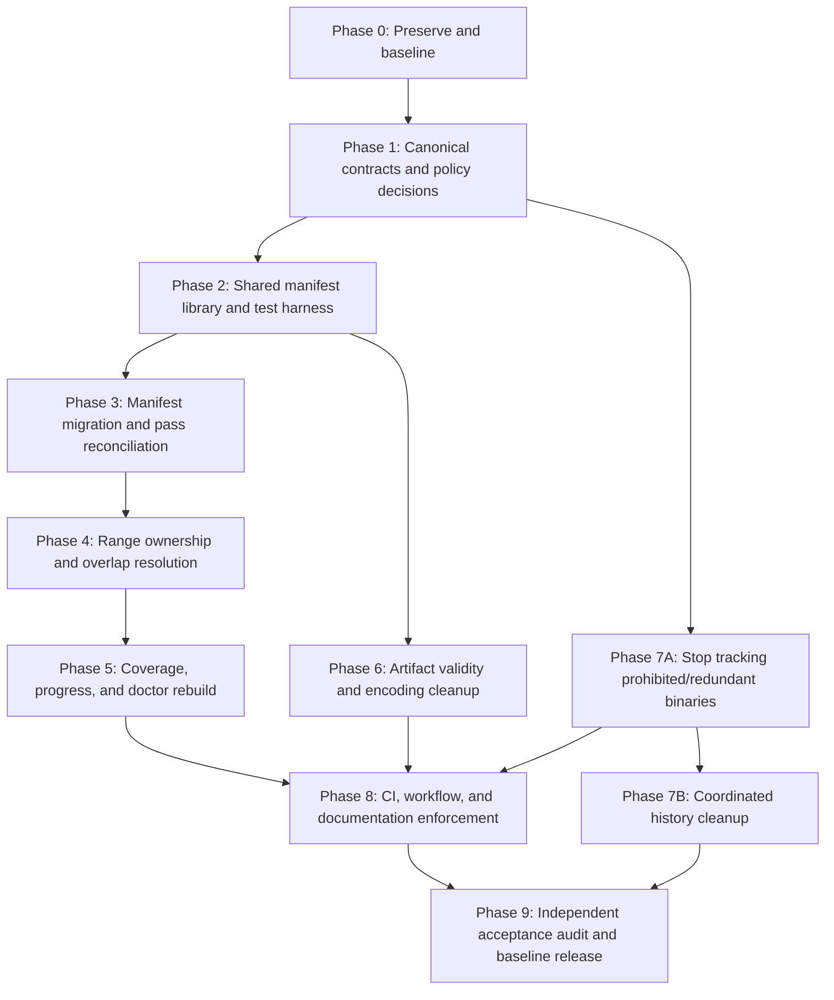

# Repository Remediation Implementation Plan

| Field | Value |
|---|---|
| Repository | Chrono Trigger Disassembly |
| Working branch at audit | `live-work-from-pass166` |
| Audit baseline commit | `c00ebe6f8e2d81f9c724c79215ac7643a5c1b353` |
| Plan created | 2026-08-18 |
| Plan status | Proposed; implementation has not started |
| Primary objective | Restore a single, validated, reproducible source of truth for manifests, range ownership, coverage, reports, and repository artifacts |

## 1. Executive summary

The repository has a substantial body of useful reverse-engineering work, but the current automation does not reliably represent that work. The most important defect is structural: the shared manifest iterator accepts only exact `passNNN.json` filenames, while recent work uses suffixed filenames and several newer schemas. As a result, the active tooling omits the repository's advertised latest passes, computes an obsolete live seam, and produces coverage data from an incomplete manifest set.

The repository also contains unresolved range overlaps, duplicate ownership records, malformed or inconsistently encoded JSON artifacts, a false-green health check, no automated test or CI gate, and tracked binaries that conflict with the repository's own policy. These issues interact: malformed files are silently skipped, overlap detection runs after ranges have already been merged, and the doctor checks only narrow happy paths.

This plan fixes those problems in controlled phases. The order is intentional:

1. preserve the current evidence and establish a repeatable baseline;
2. define the canonical data contract and policy decisions;
3. build readers and validators that can see all current data;
4. migrate manifests without losing provenance;
5. resolve range conflicts before trusting coverage;
6. rebuild progress, coverage, and doctor reports from validated inputs;
7. normalize or quarantine malformed artifacts;
8. remove prohibited and redundant binaries, with history rewriting handled separately;
9. enforce the corrected workflow in CI and documentation;
10. perform an independent final audit and cut a clean baseline release.

No phase may claim success solely because a command exits zero. Every phase has explicit data-quality and behavior-based acceptance criteria.

## 2. Target end state

At completion, the repository should have all of the following properties:

- Every pass has one unambiguous pass identity and one canonical manifest.
- The filename, manifest pass number, schema version, and pass-note identity agree.
- All active tooling uses one shared manifest discovery, normalization, and validation layer.
- Legacy schemas remain readable through explicit adapters, but all newly written manifests use the canonical schema.
- No manifest is silently skipped because of its filename, encoding, or schema.
- Every closed byte is represented by a deterministic ownership model.
- Legitimate nested ranges are modeled explicitly; accidental overlaps and duplicate owners are eliminated.
- Coverage is calculated from validated, deconflicted ranges and has a documented denominator.
- Generated reports record the Git commit, manifest-set digest, schema version, ROM digest, and generation command.
- The doctor fails on errors and exposes warnings in a way CI can enforce.
- All tracked `.json` files are UTF-8 without BOM and parse as JSON, or are renamed to their true artifact type.
- The commercial ROM is not tracked in the current tree or distributed through repository history.
- Emulator and toolkit archives have explicit provenance, licensing, retention, and distribution decisions.
- Generated caches have one canonical location and are reproducible.
- Pull requests cannot merge when manifests, range ownership, generated-state consistency, or tests fail.
- A fresh clone can run all non-ROM checks immediately and ROM-dependent checks after the user supplies a locally verified ROM.

## 3. Scope

### 3.1 In scope

- `passes/manifests/` naming, schemas, pass numbering, and duplicate resolution.
- Manifest readers, adapters, writers, checkers, and related shared utilities.
- Range overlap and ownership semantics.
- Bank progress, coverage, branch-state, xref, packaging, and doctor tooling.
- JSON report validity and encoding normalization.
- ROM, emulator, toolkit archive, and generated-cache repository hygiene.
- Automated tests, CI, dependency declarations, and contributor workflow documentation.
- Reconciliation of `README.md`, `PROGRESS.md`, local status guides, and generated reports.

### 3.2 Out of scope unless separately authorized

- Reinterpreting game logic solely to increase disassembly coverage.
- Promoting pending candidate functions without fresh technical evidence.
- Changing labels for style alone when ownership and semantics are already correct.
- Publishing binaries or artifacts to an external service.
- Rewriting Git history without maintainer approval and collaborator coordination.
- Removing historical evidence before it has been inventoried and preserved in an approved form.

## 4. Remediation principles

1. **Preserve evidence before normalization.** Keep a machine-readable mapping from every old file to its canonical replacement.
2. **Read broadly, write narrowly.** Readers may support known legacy formats; writers emit only the current canonical format.
3. **Reject ambiguity.** Duplicate pass numbers, unknown schemas, malformed ranges, and conflicting owners must be errors unless explicitly waived in a tracked registry.
4. **Never silently skip data.** A skipped file must appear in structured diagnostics and must make strict CI fail.
5. **Separate raw evidence from derived state.** Pass manifests and curated notes are inputs; coverage, caches, and reports are generated outputs.
6. **Detect before merging.** Raw overlap analysis must happen before range union or aggregation.
7. **Make provenance reproducible.** Generated artifacts must identify the exact inputs and code used.
8. **Keep destructive operations gated.** History rewriting and bulk deletion require a reviewed inventory, backup tag or bundle, and explicit approval.
9. **Prefer small reviewable pull requests.** Schema code, data migration, overlap resolution, and history cleanup should not be mixed into one unreviewable change.
10. **Require two independent checks for canonical state.** For example, JSON Schema validation plus semantic validation; or coverage recomputation plus a checked-in golden summary.

## 5. Audit baseline and success metrics

The implementation should preserve these baseline figures in an audit fixture so progress can be measured objectively.

| Metric | Audit baseline | Required final state |
|---|---:|---:|
| Files under `passes/manifests/pass*.json` | 1,000 | All intentionally retained and accounted for |
| Exact `passNNN.json` filenames accepted by current iterator | 919 | 100% of canonical manifests discovered |
| Suffixed or otherwise noncanonical manifest filenames | 81 | 0 in canonical directory, or 100% explicitly classified outside it |
| Manifest files using unknown schemas | 71 | 0 |
| Promotion-schema manifests | 8 | 0 unadapted; canonicalized with provenance retained |
| Duplicate pass identities | 38 | 0 unresolved |
| Highest pass visible to current canonical iterator | 1168 | Matches the repository's declared latest pass |
| Highest pass present in all manifest-like files | 1229 | Matches generated branch/progress state after migration |
| Missing pass numbers reported by strict branch audit | 87 | 0, or each represented by a reviewed intentional-gap registry |
| Strict range validation warnings | 154 | 0 unresolved errors; reviewed warnings within policy |
| Exact duplicate ranges | 23 | 0 unresolved |
| Non-tail overlaps | 131 | 0 unresolved accidental overlaps |
| JSON-named files failing strict UTF-8 JSON parsing | 194 | 0 |
| JSON-named files invalid even with BOM-aware decoding | 53 | 0 |
| Tracked Python files with syntax failures | 0 of 203 | 0 |
| Undefined Python names found by static analysis | 1 | 0 |
| Automated test files | 0 | Test suite covers all critical data and tooling paths |
| CI workflows | 0 | Required CI checks active |
| Tracked working-tree size | Approximately 375 MiB | Reduced according to approved retention policy |
| Tracked toolkit ZIP content | Approximately 266 MiB | Removed, externally archived, or explicitly retained by policy |
| Repeated raw xref indexes | Four copies at approximately 18 MiB each | One generated canonical cache location; no redundant tracked copies |
| Tracked commercial ROM | One 4 MiB ROM | 0 in current tree and, after approved history cleanup, 0 in reachable history |

## 6. Program dependency map



The manifest and overlap critical path is `P0 → P1 → P2 → P3 → P4 → P5 → P8 → P9`. Artifact cleanup can proceed after the shared test harness exists. Current-tree binary removal can proceed after policy decisions, but history rewriting remains a separately approved operation.

## 7. Phase 0 — Preserve evidence and establish the baseline

### Objective

Create a reproducible snapshot of the current repository state before any migration or cleanup changes data.

### Tasks

- [ ] **P0.1 — Resolve the starting worktree state.**
  - Record the existing `.gitignore` modification separately from remediation changes.
  - Decide whether it should be committed as a bootstrap change or restored by its owner.
  - Require a clean or intentionally documented worktree before migration starts.
- [ ] **P0.2 — Record immutable identifiers.**
  - Record branch, commit SHA, remote URL, Python version, dependency versions, and operating system.
  - Record the ROM SHA-256 without copying or publishing the ROM.
  - Record hashes for all manifest files, reports, archives, and generated caches.
- [ ] **P0.3 — Export machine-readable inventories.**
  - Manifest inventory: path, filename-derived pass, content-derived pass, schema family, encoding, JSON validity, range count, and source-note links.
  - Range inventory: bank, start, end, kind, label, confidence, pass, source path, and schema adapter used.
  - Artifact inventory: path, extension, detected content type, encoding, size, hash, and tracked/generated classification.
  - Binary inventory: path, size, hash, license/provenance status, and retention decision status.
- [ ] **P0.4 — Preserve current command outputs as fixtures.**
  - Built-in doctor JSON and Markdown.
  - Strict branch-state output.
  - Strict label-overlap output.
  - Current coverage output.
  - Full JSON validity summary.
  - Static-analysis output.
- [ ] **P0.5 — Establish a recovery point.**
  - Create a local Git bundle or maintainer-approved archival tag before data migration.
  - Confirm the recovery artifact can list the baseline commit.
  - Do not publish a bundle containing the ROM to an unauthorized location.
- [ ] **P0.6 — Create an audit fixture.**
  - Add a compact, non-copyrighted fixture representing every known manifest schema and every failure mode.
  - Include duplicate pass IDs, suffixed filenames, malformed ranges, nested helpers, duplicate ranges, UTF-8 BOM, UTF-16 JSON, plain text mislabeled as JSON, and empty files.

### Deliverables

- `reports/remediation/baseline_inventory.json`
- `reports/remediation/baseline_summary.md`
- `reports/remediation/manifest_inventory.json`
- `reports/remediation/range_conflicts.json`
- `reports/remediation/artifact_inventory.json`
- A documented recovery procedure and approved storage location

### Validation

```powershell
git status --short --branch
git rev-parse HEAD
git fsck --full
python --version
python tools/scripts/toolkit_doctor.py --output-json reports/remediation/baseline_doctor.json --output-md reports/remediation/baseline_doctor.md
python tools/scripts/audit_branch_state_v1.py --strict-gaps
python tools/scripts/validate_labels.py --manifests-dir passes/manifests --strict-overlaps
```

Expected baseline failures must be captured, not treated as phase failure.

### Exit criteria

- Every tracked manifest-like, JSON-like, archive, ROM, emulator, and cache file appears in an inventory.
- The inventories include hashes and can be regenerated deterministically.
- A reviewed recovery point exists.
- The worktree state at migration start is unambiguous.

## 8. Phase 1 — Define canonical contracts and policy decisions

### Objective

Resolve design questions before code and data migration begin.

### 8.1 Canonical manifest contract

Adopt one canonical filename and one canonical schema version. Recommended choices:

- Canonical path: `passes/manifests/passNNNN.json`, with enough zero padding for lexical and numeric order to agree. If retaining unpadded historical names is preferred, discovery must still sort by parsed integer rather than path text.
- Canonical identity field: `pass_number`, integer, exactly equal to the filename-derived number.
- Canonical schema marker: `schema_version`, integer or semantic version string.
- Canonical range field: `closed_ranges`.
- Canonical range syntax: `BB:AAAA..BB:EEEE`, uppercase hexadecimal, inclusive endpoints, same bank.
- Canonical pass status: `draft`, `reviewed`, `accepted`, or `superseded`.
- Canonical source link fields for pass notes, label notes, reports, predecessor pass, and superseded manifests.
- Canonical provenance: branch, source commit, toolkit version, ROM SHA-256, authoring session, and creation timestamp with timezone.

The canonical schema should distinguish between a pass that closes ranges and a scan-only report. A scan that does not close a range should not masquerade as a pass manifest.

### 8.2 Recommended canonical manifest shape

```json
{
  "schema_version": 2,
  "pass_number": 1229,
  "status": "reviewed",
  "branch": "live-work-from-pass166",
  "toolkit_version": "repo-native-vNext",
  "rom_sha256": "06d1c2b06b716052c5596aaa0c2e5632a027fee1a9a28439e509f813c30829a9",
  "live_seam_after_pass": "C3:D000..",
  "closed_ranges": [
    {
      "range": "C3:CB47..C3:CB64",
      "kind": "code_owner",
      "label": "ct_c3_cb47_php_prologue",
      "confidence": "medium",
      "verification_status": "reviewed",
      "evidence": {
        "source": "backtrack",
        "score": 6,
        "callers": ["C3:28E9"]
      }
    }
  ],
  "new_labels": ["ct_c3_cb47_php_prologue"],
  "confidence": {
    "structural": "medium",
    "semantic": "medium",
    "rebuild": "low"
  },
  "sources": {
    "disassembly_note": "passes/disasm/pass1229.md",
    "legacy_manifest": "passes/manifests/legacy/pass1229_c3_cb47.json"
  },
  "notes": []
}
```

The final schema may differ, but the decision must be recorded in an architecture decision record before migration.

### 8.3 Ownership model decisions

Define the allowed range relationships explicitly:

- `code_owner`: top-level executable owner; may not overlap another active top-level owner.
- `code_helper`: independently callable range; must either be disjoint or explicitly reference a containing owner using `parent_range_id` if nested representation is intentionally supported.
- `wrapper` and `veneer`: callable executable units with the same ownership rules as helpers.
- `data` and `text_marker`: non-executable ownership; may not overlap executable ownership unless an explicit mixed-content exception exists.
- `tail_fragment`: temporary classification requiring `parent_range_id`, `review_by_pass`, or a tracked waiver.
- `superseded`: historical range no longer included in active coverage.

Decide whether nested helpers contribute to coverage independently. Recommended behavior: coverage uses the byte union, while ownership reports retain the parent-child relationship without double counting.

### 8.4 Pass numbering decisions

- Decide whether missing numbers are genuine missing manifests, abandoned drafts, scan-only artifacts, or intentional gaps.
- Create `tools/config/intentional_pass_gaps.json` only for reviewed intentional gaps.
- Reject duplicate active pass numbers.
- Permit historical duplicates only in a clearly separated legacy directory with a migration map.
- Never infer the newest pass from lexical filename order.

### 8.5 Artifact policy decisions

- Define canonical encodings: UTF-8 without BOM for JSON, YAML, Markdown, Python, and text reports.
- Define which report classes are tracked and which are generated/ignored.
- Define retention for raw scan output, xref indexes, toolkit release ZIPs, and emulator packages.
- Define whether the emulator binary has a redistributable license and whether that license is present.
- Confirm the ROM must never be tracked, attached to releases, cached in CI, or copied into test fixtures.

### Deliverables

- `docs/adr/0001-canonical-pass-manifest.md`
- `docs/adr/0002-range-ownership-and-coverage.md`
- `docs/adr/0003-generated-artifact-and-binary-policy.md`
- Updated `tools/config/pass_manifest_schema.json`
- `tools/config/intentional_pass_gaps.json`
- A reviewed legacy-schema classification table

### Exit criteria

- Maintainers have approved the canonical filename, identity, schema, ownership, coverage, and artifact policies.
- Every known current schema maps to either a canonical adapter or a non-manifest artifact category.
- The plan for duplicate pass IDs is explicit before files are renamed.
- No migration code is merged while key contract decisions remain implicit.

## 9. Phase 2 — Build the shared manifest layer and automated test harness

### Objective

Make tooling capable of discovering, parsing, normalizing, and validating all existing data before changing that data.

### 9.1 Create a shared manifest package

Move manifest behavior out of ad hoc script logic into a small package, for example:

```text
tools/ctrepo/
  __init__.py
  manifest_discovery.py
  manifest_models.py
  manifest_adapters.py
  manifest_validation.py
  range_model.py
  provenance.py
```

Required APIs:

- `discover_manifest_candidates(path)`: enumerate every candidate and report why it is or is not canonical.
- `detect_schema(document)`: return a named schema family or a structured unknown-schema error.
- `parse_pass_identity(path, document)`: compare filename, content, and note identity.
- `normalize_manifest(document, source_path)`: adapt legacy data into an in-memory canonical model without rewriting the source.
- `validate_manifest(model, strict=True)`: run schema and semantic checks.
- `iter_manifests(order="pass_number")`: yield numerically sorted canonical models and diagnostics.
- `manifest_set_digest(models)`: produce a deterministic digest for generated report provenance.

### 9.2 Discovery requirements

- Discover exact names, suffixed names, underscore names, and other known historical patterns during migration.
- Sort by parsed integer pass number, then deterministic source-path tie-breaker.
- Emit an error for duplicate active pass numbers.
- Emit an error when filename and document identities differ.
- Emit an error when no pass identity can be established.
- Never use `except Exception: pass`.
- Return diagnostics in machine-readable form, including source path and adapter.

### 9.3 Adapter requirements

Implement explicit adapters for at least:

- canonical `closed_ranges` manifests;
- legacy `targets` manifests;
- single-target records using `start_address` and `end_address`;
- records using `range` at the top level;
- `promotions` manifests using `function_range`;
- scan-only records that must be classified as reports rather than manifests.

Each adapter must preserve source fields under a `legacy_metadata` or provenance section. Adapters must not silently invent confidence, ownership, or verification values; inferred values must be marked as inferred.

### 9.4 Semantic validation requirements

Beyond JSON Schema, validate:

- filename pass number equals document pass number;
- pass number is positive and unique among active manifests;
- source paths exist when required;
- ranges parse, remain within one bank, and do not reverse endpoints;
- range kinds and confidence values use controlled vocabularies;
- labels are nonempty and conform to naming rules;
- accepted promotions are not still marked `pending_final_review`;
- ROM hashes use 64 lowercase hexadecimal characters;
- open-ended live seams are valid but closed ranges are not open-ended;
- every active pass has a deterministic predecessor or an intentional-gap explanation;
- superseded manifests identify their replacement;
- generated timestamps contain timezones when timestamps are required.

### 9.5 Test harness

Add `pytest` and focused fixtures. Minimum tests:

- discovery includes all 1,000 baseline candidates;
- strict canonical discovery excludes nothing without a diagnostic;
- numeric ordering places pass 999 before pass 1000 and pass 1168 before pass 1200;
- pass 1229 promotion schema normalizes to the expected closed range;
- duplicate pass identities are deterministic hard failures;
- unknown schemas are hard failures in strict mode;
- filename/content identity mismatches fail;
- UTF-8 BOM and UTF-16 legacy inputs produce explicit migration diagnostics;
- malformed JSON reports path, encoding, and parser failure;
- empty files fail with an actionable message;
- range syntax and HiROM conversions have boundary tests;
- nested owner/helper rules match the approved ownership ADR;
- `audit_branch_state` with an empty sessions directory does not crash;
- all CLI entrypoints return documented exit codes.

### 9.6 Immediate code corrections covered by this phase

- Import `json` in `audit_branch_state_v1.py` and add the empty-sessions regression test.
- Replace the exact-name-only iterator in `snes_utils.py` with the shared discovery layer.
- Update `snes_utils_hirom_v2.py` compatibility exports.
- Update every consumer found by static search, including:
  - branch-state audit;
  - pass-manifest audit;
  - label validation;
  - bank progress generation;
  - manifest xref utilities;
  - toolkit release packaging;
  - seam workspace preparation;
  - coverage generators;
  - promotion helpers.
- Deprecate direct `glob('pass*.json')` usage outside the shared package.

### Deliverables

- Shared manifest package
- Unit and integration test suite
- Test fixtures for all known schemas and failure cases
- Updated CLI consumers
- Deprecation warnings for legacy imports and direct globbing

### Validation

```powershell
python -m pytest -q
python -m pyflakes tools
python -m compileall -q tools
python tools/scripts/check_all_manifests.py --manifests-dir passes/manifests --allow-legacy --report reports/remediation/pre_migration_manifest_check.json
```

### Exit criteria

- Tests demonstrate that every baseline manifest candidate is discovered and classified.
- No active consumer performs independent manifest globbing or schema guessing.
- Unknown schemas, duplicate pass IDs, malformed files, and identity mismatches are visible failures.
- The empty-sessions branch audit regression is fixed.
- No canonical data has been rewritten yet; this phase proves the reader first.

## 10. Phase 3 — Migrate manifests and reconcile pass history

### Objective

Convert the heterogeneous manifest collection into one canonical, unique, numerically ordered pass history without losing provenance.

### 10.1 Generate a migration plan, not direct edits

Create a dry-run migration tool that emits:

- source path;
- detected schema;
- parsed pass identity;
- proposed canonical destination;
- proposed canonical document hash;
- source pass-note and label-note links;
- duplicate group membership;
- conflict status;
- fields inferred or dropped;
- whether human review is required.

The first run must make no repository changes.

### 10.2 Resolve the 38 duplicate pass identities

For each duplicate group:

1. compare closed ranges and labels;
2. compare source notes and session reports;
3. determine whether files are duplicates, complementary fragments, corrections, or unrelated work using the same number;
4. choose one of these outcomes:
   - merge into one canonical manifest;
   - mark one as superseded and preserve its path in provenance;
   - renumber an incorrectly numbered pass with all cross-references updated;
   - classify a non-pass record as a report and move it out of the manifest directory;
5. record the decision in `manifest_migration_map.json`.

No automated rule should renumber a pass solely to make numbering contiguous.

### 10.3 Reconcile missing pass numbers

For each of the 87 gaps reported by the old strict audit:

- Check whether an excluded suffixed filename already contains the pass.
- Check pass notes, label notes, session reports, and commit history.
- If a canonical pass exists, migrate it.
- If the number was a draft or scan-only record, add a reviewed intentional-gap entry.
- If evidence is missing, leave a blocking unresolved-gap record rather than fabricating a pass.

### 10.4 Convert recent passes 1200–1229 first as a pilot

Use the newest work as the migration pilot because it exposes the exact filename and schema defects that broke current progress.

- Normalize passes 1200–1219 from suffixed canonical-like manifests.
- Classify pass 1220's mixed promotion/frozen-range structure.
- Determine whether pass 1221 exists, is intentionally absent, or is represented elsewhere.
- Classify pass 1222 as a scan report if it does not close ranges.
- Convert passes 1223–1229 from promotion schema to canonical closed ranges.
- Resolve `pending_final_review` status before calling any promotion accepted.
- Ensure pass 1229's live seam is represented canonically.
- Run progress and branch-state tools against only the pilot set before migrating older files.

### 10.5 Migrate the remaining history in bounded batches

Recommended batches:

- passes 1–191: early canonical and continuation-era baseline;
- passes 192–306: manifest-backed continuation;
- passes 307–715: agent-swarm expansion;
- passes 716–991: first major duplicate/suffixed region;
- passes 992–1039: mixed single-target and top-level range schemas;
- passes 1040–1168: numbering and underscore-filename region;
- passes 1200–1229: pilot already completed and revalidated.

For each batch:

- run dry-run conversion;
- review all inferred fields;
- apply migration;
- validate schema and semantics;
- compare normalized range inventory against the pre-migration adapter output;
- verify no range disappears without a recorded decision;
- commit the batch separately.

### 10.6 Preserve legacy evidence

Recommended strategy:

- Keep canonical manifests in `passes/manifests/`.
- Move source legacy records that retain unique evidence to `passes/manifests/legacy/` or a compressed, non-executable archival format.
- Add `manifest_migration_map.json` mapping every original path and hash to its canonical destination and disposition.
- Do not let legacy files participate in active progress or coverage.
- If Git history alone is deemed sufficient for byte-for-byte legacy preservation, document that decision before removing duplicates from the tree.

### Deliverables

- Canonical manifest set
- `passes/manifests/manifest_migration_map.json`
- `tools/config/intentional_pass_gaps.json`
- Migration tool with `--dry-run`, `--apply`, and `--verify` modes
- Per-batch migration reports

### Validation

```powershell
python tools/scripts/migrate_manifests.py --dry-run --report reports/remediation/manifest_migration_dry_run.json
python tools/scripts/check_all_manifests.py --strict
python tools/scripts/audit_branch_state_v1.py --strict-gaps
python tools/scripts/compare_manifest_range_inventory.py reports/remediation/baseline_ranges.json reports/remediation/post_migration_ranges.json
```

### Exit criteria

- Every active manifest has one canonical filename and schema.
- Highest canonical pass matches the approved current state.
- Duplicate active pass IDs are zero.
- Unknown active schemas are zero.
- Missing pass numbers are zero or explicitly listed as reviewed intentional gaps.
- Every source manifest path is represented in the migration map.
- Pre- and post-migration range differences are fully explained.

## 11. Phase 4 — Resolve range ownership, duplicates, and overlaps

### Objective

Make closed-range ownership internally consistent before coverage is considered authoritative.

### 11.1 Replace pairwise warning text with structured conflicts

The conflict detector should emit records containing:

- conflict ID;
- bank and intersecting byte range;
- left and right pass numbers;
- left and right source paths;
- kinds, labels, confidence, and status;
- relationship type: exact duplicate, partial overlap, containment, boundary-touch, or invalid cross-bank range;
- suggested resolution class;
- waiver or resolution reference.

Use an interval-tree or sorted sweep implementation rather than an unstructured global list. Keep deterministic ordering.

### 11.2 Resolution decision tree

For each conflict:

1. **Exact same range and same semantics**
   - Retain the earliest authoritative owner or the reviewed replacement.
   - Mark the other pass as reaffirmation or superseded evidence, not a second active owner.
2. **Exact same range but changed semantics/confidence**
   - Treat as a revision.
   - Preserve both pass events, but only the latest accepted ownership record participates in current coverage.
3. **Parent owner containing a callable helper**
   - Split into disjoint owners, or model the helper as an explicit child according to the ownership ADR.
   - Ensure coverage counts the byte union once.
4. **Tail fragment overlap**
   - Require an explicit parent and resolution deadline.
   - Do not allow the mere presence of `tail_fragment` to suppress every overlap automatically.
5. **Code/data overlap**
   - Treat as blocking until bytes are reclassified or a documented mixed-content representation is approved.
6. **Off-by-one endpoint overlap**
   - Verify inclusive endpoints against disassembly and ROM bytes.
   - Correct the manifest with evidence and update related notes.
7. **Unrelated partial owners**
   - Re-disassemble the intersection and assign one authoritative boundary.

### 11.3 Work in priority order

- First: exact duplicates, because they can often be resolved by provenance.
- Second: code/data conflicts, because they invalidate semantic coverage.
- Third: large containment overlaps.
- Fourth: partial code/code overlaps.
- Fifth: boundary-only and tail-fragment cases.

### 11.4 Add an explicit waiver registry

If any overlap is temporarily accepted, store it in `tools/config/range_overlap_waivers.json` with:

- conflict ID;
- exact ranges and source paths;
- rationale;
- approving reviewer;
- expiration condition or target pass;
- whether coverage should include the union, parent only, or neither.

CI should reject stale, unmatched, or overbroad waivers.

### 11.5 Regression coverage

Add tests for examples discovered in the audit, including:

- pass 1000 versus pass 1006 partial overlap;
- pass 165 versus pass 169 exact duplicate ranges;
- parent/helper containment;
- tail-fragment exception behavior;
- inclusive endpoint collisions;
- duplicate labels on distinct ranges.

### Deliverables

- Structured conflict detector
- Reviewed conflict-resolution ledger
- Optional narrowly scoped waiver registry
- Corrected canonical manifests and notes
- Range ownership tests

### Validation

```powershell
python tools/scripts/validate_range_ownership.py --strict --output-json reports/range_ownership.json --output-md reports/range_ownership.md
python tools/scripts/validate_labels.py --manifests-dir passes/manifests --strict-overlaps
python -m pytest -q tests/test_range_ownership.py
```

### Exit criteria

- Zero unresolved exact duplicates.
- Zero unresolved accidental overlaps.
- Every legitimate nested relationship is explicit and schema-valid.
- Every temporary waiver is narrow, reviewed, and machine-enforced.
- Coverage input can be represented as a deterministic byte union without ambiguity.

## 12. Phase 5 — Rebuild coverage, progress, branch state, and doctor reporting

### Objective

Generate trustworthy derived state from the validated canonical manifest set.

### 12.1 Correct the coverage algorithm

Required sequence:

1. discover and validate all canonical manifests;
2. fail on unknown or skipped inputs in strict mode;
3. collect raw ownership ranges;
4. detect and report duplicates and overlaps;
5. apply reviewed supersession and waiver rules;
6. compute a non-overlapping byte union per bank;
7. calculate coverage using a documented denominator;
8. produce machine-readable and human-readable reports from the same result object.

Do not merge ranges before diagnostics. Do not suppress parse failures. Do not calculate overlap counts from already merged data.

### 12.2 Define coverage metrics precisely

Report separate metrics rather than one ambiguous percentage:

- executable bytes accepted;
- data/text bytes classified;
- total uniquely closed bytes;
- unresolved bytes;
- manifest-backed bytes;
- continuation-note-backed bytes;
- frozen or provisional bytes;
- bank denominator and included bank set;
- byte union count versus range-record count.

If a total percentage spans only selected banks, name that bank set. Do not compare it directly to whole-ROM coverage.

### 12.3 Add report provenance

Every generated JSON and Markdown report should include:

- generator name and version;
- generation timestamp in UTC;
- Git commit;
- dirty-worktree flag;
- canonical schema version;
- manifest count;
- manifest-set digest;
- intentional-gap and waiver registry digests;
- ROM SHA-256 when ROM-dependent;
- full command line or normalized invocation parameters.

Generated reports from a dirty worktree should be clearly marked and should not be publishable as canonical without an override.

### 12.4 Correct bank progress

- Compute `latest_pass` from the maximum validated pass identity, not traversal order.
- Compute each bank's latest seam only from relevant, explicitly defined seam fields.
- Do not allow a C0 region to become the C3 live seam.
- Distinguish global latest pass from bank-local latest pass.
- Compare generated progress against curated state and fail when they diverge without an approved explanation.

### 12.5 Correct branch-state auditing

- Import all required modules.
- Treat missing live seams, duplicate passes, unclassified gaps, and schema failures as explicit statuses.
- Add `--strict` as the CI behavior, covering gaps, missing seams, stale generated reports, and dirty provenance.
- Use structured JSON output in addition to console text.
- Exit nonzero when strict warnings exist.

### 12.6 Rebuild toolkit doctor

Replace hardcoded two-file smoke checks with repository-wide checks:

- compile all tracked Python files, not only `tools/scripts/*.py`;
- static undefined-name check;
- full canonical manifest schema validation;
- full semantic manifest validation;
- branch-state strict check;
- range ownership strict check;
- JSON artifact validity check;
- generated-report freshness check;
- CLI help smoke tests;
- unit and integration tests;
- binary-policy check;
- forbidden direct manifest-glob check;
- duplicate helper drift check.

Doctor output should distinguish:

- `pass`: no finding;
- `warn`: visible technical debt that does not block local exploratory work;
- `fail`: canonical state cannot be trusted;
- `skipped`: check could not run, with a reason.

The overall score must not report 100% when warnings or skipped checks exist. CI should use status, not a percentage.

### 12.7 Reconcile published documentation

Regenerate or manually reconcile:

- `README.md` current pass and seam;
- `PROGRESS.md` coverage and manifest totals;
- `passes/README.md` canonical boundary;
- bank progress JSON;
- toolkit doctor reports;
- authority-map and resume documents.

### Deliverables

- One supported coverage generator
- One supported bank-progress generator
- Strict branch-state audit
- Full-repository doctor
- Provenance-rich generated reports
- Reconciled top-level progress documentation

### Validation

```powershell
python tools/scripts/generate_coverage.py --strict --output-json reports/coverage.json --output-md reports/coverage.md
python tools/scripts/update_bank_progress.py --bank C3 --strict
python tools/scripts/audit_branch_state_v1.py --strict --output-json reports/branch_state.json
python tools/scripts/toolkit_doctor.py --strict
git diff --exit-code -- reports tools/config/*.generated.json PROGRESS.md
```

### Exit criteria

- Coverage reports all raw conflicts before applying unions.
- Strict generation fails on skipped, malformed, unknown, duplicate, or unresolved inputs.
- C3 progress reports the approved latest C3 pass and seam.
- Reported manifest totals match canonical discovery exactly.
- `README.md`, `PROGRESS.md`, generated JSON, and doctor agree.
- The same clean commit produces byte-identical structured reports except for an explicitly isolated timestamp field.

## 13. Phase 6 — Normalize, regenerate, or quarantine malformed artifacts

### Objective

Ensure file extensions, encodings, and contents are truthful and machine-consumable.

### 13.1 Classify all 194 strict JSON failures

Use these disposition categories:

- valid JSON encoded as UTF-16;
- valid JSON with UTF-8 BOM;
- plain-text analysis mislabeled `.json`;
- captured traceback or command failure mislabeled `.json`;
- empty file;
- truncated JSON;
- obsolete generated cache;
- unknown and requiring human review.

### 13.2 Normalize valid data

- Decode with the detected source encoding.
- Parse into an object before rewriting.
- Write UTF-8 without BOM using deterministic formatting.
- Compare parsed objects before and after to ensure semantic equivalence.
- Preserve original hash and encoding in the artifact migration report.

### 13.3 Correct mislabeled artifacts

- Rename prose reports to `.md` or `.txt`.
- Rename command failures to `.log`, or remove them if reproducibly generated and valueless.
- Never convert a traceback into a fake JSON string merely to satisfy parsing.
- Replace meaningful empty collections with `[]` or `{}` only when the expected schema proves that representation is correct.
- Delete empty or failed outputs only after provenance review and only in a dedicated cleanup commit.

### 13.4 Regenerate canonical reports

- Regenerate artifacts when a supported generator and input provenance exist.
- Mark artifacts that cannot be reproduced as historical.
- Move historical noncanonical outputs under a clearly documented archive directory if they must remain.
- Remove generated caches from source-oriented directories such as `tools/scripts/tools/cache/`.

### 13.5 Enforce artifact validity

Add a repository check that:

- loads every tracked `.json` as UTF-8 without BOM;
- parses every tracked YAML file safely;
- rejects empty structured-data files unless explicitly allowlisted;
- rejects likely traceback text in `.json` files;
- verifies generated artifact schemas where available;
- verifies no report contains machine-local absolute paths unless explicitly redacted or allowed.

### Deliverables

- `reports/remediation/artifact_migration_map.json`
- Normalized structured artifacts
- Renamed or quarantined non-JSON artifacts
- JSON/YAML repository validator
- Documented generated-versus-curated artifact policy

### Validation

```powershell
python tools/scripts/validate_repository_artifacts.py --strict
python -m pytest -q tests/test_artifact_validation.py
git grep -n "Traceback (most recent call last)" -- "*.json"
```

### Exit criteria

- Every tracked `.json` file is UTF-8 without BOM and valid JSON.
- No `.json` file contains prose, a traceback, or an empty failed command output.
- Every removed or renamed artifact has a migration-map entry.
- Active generators write only canonical encodings and atomic outputs.
- Silent exception suppression has been removed from active report generators.

## 14. Phase 7 — Binary, archive, cache, and repository-history hygiene

### Objective

Align the repository with its own policy, reduce distribution risk, and remove redundant generated bulk.

### 14.1 Phase 7A — Current-tree cleanup

#### ROM handling

- [ ] Add ROM patterns to `.gitignore`, including `.sfc`, `.smc`, and known local ROM paths.
- [ ] Remove the ROM from the Git index while preserving a user's local file where appropriate.
- [ ] Add `rom/README.md` explaining how the user supplies the ROM locally.
- [ ] Keep only the expected SHA-256 and supported size/header expectations.
- [ ] Add a ROM verification command that reports mismatch without uploading or copying the ROM.
- [ ] Ensure tests use synthetic byte fixtures rather than game bytes.
- [ ] Ensure CI never downloads, caches, or expects the commercial ROM.

#### Emulator handling

- [ ] Identify the exact emulator build, source URL, license, and redistribution terms.
- [ ] If redistribution is not clearly authorized, remove the ZIP and document installation instructions.
- [ ] If retained, include the required license and provenance metadata and verify archive integrity.

#### Toolkit archives

- [ ] Inventory the 82 archives and identify unique content versus repeated snapshots.
- [ ] Decide a retention rule, such as keeping only signed/checksummed milestone releases outside the Git tree.
- [ ] Prefer release attachments or approved artifact storage for distributable toolkit bundles.
- [ ] Keep reproducible source in Git; generate ZIPs during release automation.
- [ ] Add archive checksums and source-commit references to release metadata.

#### Xref and generated caches

- [ ] Choose one canonical local cache path, recommended `tools/cache/` or `.cache/ct-disassembly/`.
- [ ] Treat raw xref indexes as generated outputs keyed by ROM hash and generator version.
- [ ] Remove the four redundant tracked copies after verifying regeneration.
- [ ] Update all scripts to resolve cache paths through one helper.
- [ ] Add caches to `.gitignore` unless a small stable fixture is needed for tests.

### 14.2 Phase 7B — Coordinated history cleanup

History rewriting is destructive to clone continuity and must not be bundled casually with normal fixes.

#### Approval gate

Before rewriting history:

- obtain explicit maintainer approval;
- announce the freeze window to all collaborators;
- merge or close outstanding branches that must survive;
- create an approved backup bundle and verify it;
- record protected tags and branch tips;
- choose `git filter-repo` or another reviewed tool;
- prepare exact path and blob filters from the binary inventory;
- decide whether toolkit archives and redundant caches are also purged historically.

#### Dry run

- Rewrite a disposable mirror clone first.
- Verify branch and tag counts.
- Verify the ROM blob is unreachable in the rewritten mirror.
- Verify repository integrity with `git fsck --full`.
- Re-run the complete test and audit suite.
- Compare canonical source and manifest tree hashes between old and rewritten tips, excluding approved removals.
- Measure resulting clone and pack sizes.

#### Production rewrite

- Freeze pushes.
- Re-run the exact reviewed filter command.
- Force-update only approved branches and tags.
- Invalidate caches and release artifacts that may still contain removed blobs.
- Publish fresh-clone instructions; do not encourage merging old history back into the cleaned repository.
- Keep the backup in restricted storage for the approved retention period.

#### Verification

```powershell
git rev-list --objects --all | Select-String -Pattern "Chrono Trigger \(USA\)\.sfc"
git fsck --full
git count-objects -vH
```

The first command must return no reachable ROM path after the approved rewrite. Blob-hash verification should also be performed because paths can change.

### Deliverables

- Updated `.gitignore`
- Local ROM setup and verification documentation
- Binary provenance and retention record
- Reproducible toolkit packaging process
- One canonical generated-cache strategy
- Optional approved history-rewrite runbook and completion report

### Exit criteria

- Current branch tracks no ROM or unauthorized emulator binary.
- No generated toolkit ZIP is committed without explicit retention approval.
- Redundant xref cache copies are removed and reproducible.
- Fresh clone size is materially reduced.
- If Phase 7B is approved, the ROM blob is absent from all reachable rewritten history and collaborators have migrated to fresh clones.

## 15. Phase 8 — CI, contributor workflow, and documentation enforcement

### Objective

Make regression difficult and the correct workflow obvious.

### 15.1 CI jobs

Add a CI workflow with separate, diagnosable jobs:

1. **Python quality**
   - supported Python matrix;
   - dependency installation from declared files;
   - syntax compilation;
   - undefined-name/static checks;
   - unit tests.
2. **Manifest integrity**
   - canonical filename and identity validation;
   - full JSON Schema validation;
   - semantic validation;
   - uniqueness and intentional-gap validation;
   - migration-map consistency.
3. **Range ownership**
   - duplicates;
   - overlaps;
   - nested relationship validation;
   - waiver validation.
4. **Artifact integrity**
   - UTF-8 JSON/YAML validation;
   - no traceback content in structured files;
   - generated/curated placement rules;
   - no machine-local path leakage.
5. **Generated-state freshness**
   - regenerate non-ROM-derived reports;
   - fail if tracked generated files differ;
   - verify provenance fields.
6. **Repository policy**
   - forbidden ROM and binary patterns;
   - oversized tracked files;
   - forbidden cache paths;
   - no direct manifest globbing outside the shared library.
7. **CLI smoke tests**
   - `--help` for supported entrypoints;
   - no-ROM behavior;
   - synthetic-ROM fixture behavior where applicable.

ROM-dependent deep analysis should remain a documented local job unless a legally safe synthetic fixture covers the behavior.

### 15.2 Dependency management

- Declare supported Python versions.
- Separate runtime and development dependencies.
- Add `pytest`, static-analysis, and JSON Schema tooling to development dependencies.
- Use bounded dependency versions and a documented update process.
- Avoid relying on an undeclared globally installed package.
- Add a clean-environment installation smoke test.

### 15.3 Contributor commands

Provide one supported command per task, ideally through a small task runner or Python entrypoint:

```powershell
python -m tools.ctrepo check
python -m tools.ctrepo test
python -m tools.ctrepo coverage
python -m tools.ctrepo doctor
python -m tools.ctrepo verify-rom --rom "rom/Chrono Trigger (USA).sfc"
```

The exact interface may differ, but documentation should not require contributors to choose among multiple versioned scripts for the same operation.

### 15.4 Documentation updates

Update:

- root `README.md` with setup, source-of-truth rules, and current state generation;
- `tools/README.md` with supported entrypoints and deprecations;
- `tools/docs/workflow.md` with canonical pass lifecycle;
- `tools/docs/repo_layout.md` with enforceable generated/binary policy;
- `passes/README.md` with manifest contract and migration boundary;
- `reports/README.md` with generated versus curated report rules;
- contributor guide with local checks and pull-request expectations;
- authority map with canonical inputs and derived outputs;
- release checklist.

### 15.5 Pull-request requirements

Require that a pass-changing pull request include:

- canonical manifest;
- referenced disassembly/label notes;
- schema and semantic validation;
- range ownership validation;
- regenerated affected progress reports;
- explanation for coverage changes;
- no ROM or generated cache additions;
- green CI.

### Deliverables

- Required CI workflow
- Declared runtime and development dependencies
- Contributor guide
- Canonical command reference
- Pull-request template and release checklist

### Exit criteria

- A fresh clone passes all non-ROM CI checks.
- Deliberately introducing a suffixed active manifest, duplicate pass, overlap, malformed JSON, stale report, ROM, or direct manifest glob causes the expected CI job to fail.
- Documentation names one supported path for each common operation.
- Branch protection requires the critical CI jobs.

## 16. Phase 9 — Independent acceptance audit and clean baseline release

### Objective

Prove the remediated repository is internally consistent and reproducible before declaring completion.

### Tasks

- [ ] Run the full suite from a fresh clone in a new directory.
- [ ] Run on every supported Python version.
- [ ] Verify non-ROM checks without a ROM present.
- [ ] Supply a local verified ROM and run ROM-dependent checks.
- [ ] Recompute manifest, range, coverage, and artifact inventories.
- [ ] Compare final metrics against the targets in Section 5.
- [ ] Verify pass-note, label-note, and manifest cross-references.
- [ ] Verify the declared latest pass and seam across all reports.
- [ ] Verify generated reports are clean-tree reproducible.
- [ ] Verify no prohibited binaries or redundant caches are tracked.
- [ ] If history was rewritten, verify removed blobs are unreachable and clone instructions work.
- [ ] Have a reviewer who did not implement the migration inspect a sample from each schema-era batch and each overlap-resolution class.
- [ ] Publish a remediation completion report containing remaining accepted debt, if any.
- [ ] Tag a clean baseline only after all required gates pass.

### Final acceptance commands

```powershell
git status --porcelain
python -m pytest -q
python -m pyflakes tools
python tools/scripts/check_all_manifests.py --strict
python tools/scripts/validate_range_ownership.py --strict
python tools/scripts/validate_repository_artifacts.py --strict
python tools/scripts/audit_branch_state_v1.py --strict
python tools/scripts/toolkit_doctor.py --strict
python tools/scripts/generate_coverage.py --strict
git diff --exit-code
git fsck --full
```

### Exit criteria

- All final acceptance commands pass from a clean clone.
- Canonical latest pass, live seam, manifest count, closed-range count, and coverage agree everywhere.
- No unresolved P1 or P2 audit finding remains.
- Any retained lower-priority debt has an owner, rationale, and review date.
- A maintainer signs off on the completion report and baseline tag.

## 17. Proposed pull-request sequence

Keep the work reviewable with a sequence similar to the following:

| PR | Scope | Depends on | Primary risk |
|---|---|---|---|
| 1 | Baseline inventories, fixtures, and audit tests | None | Accidentally treating expected baseline failures as regressions |
| 2 | ADRs, canonical schema, ownership policy, artifact policy | PR 1 | Making irreversible assumptions too early |
| 3 | Shared manifest discovery/adapter library and tests | PR 2 | Incomplete legacy classification |
| 4 | Update all consumers; fix branch-audit runtime failure | PR 3 | Behavior drift across many scripts |
| 5 | Pilot migration for passes 1200–1229 | PR 4 | Losing recent promotion metadata |
| 6 | Historical manifest migration in bounded batches | PR 5 | Duplicate pass and cross-reference mistakes |
| 7 | Structured range conflict detector | PR 3 | Misclassifying legitimate nesting |
| 8+ | Conflict-resolution batches | PRs 6–7 | Semantic boundary mistakes |
| 9 | Coverage/progress/doctor rebuild | Conflict resolution | Publishing metrics before ownership is stable |
| 10 | JSON/artifact normalization | PR 3 | Destroying historical evidence |
| 11 | Current-tree ROM, binary, archive, and cache cleanup | Policy ADR | Local user setup disruption |
| 12 | CI, docs, contributor workflow, and branch protection | PRs 9–11 | CI enforcing unstable rules prematurely |
| 13 | Optional coordinated history rewrite | Explicit approval | Invalidating existing clones and branches |
| 14 | Final audit, completion report, and baseline tag | All required PRs | Declaring completion with hidden stale state |

Manifest migration and conflict resolution will likely require multiple PRs; the table describes logical milestones, not a requirement to force all historical data into a single change.

## 18. Testing strategy

### 18.1 Unit tests

- address and range parsing;
- HiROM file-offset round trips;
- schema detection;
- pass identity parsing;
- legacy adapter field mapping;
- deterministic numeric ordering;
- ownership relationship classification;
- interval union and overlap detection;
- artifact encoding detection;
- manifest-set and provenance digests.

### 18.2 Integration tests

- discover and classify the full repository manifest set;
- migrate a copied fixture tree and verify the migration map;
- generate branch state from canonical manifests plus continuation notes;
- generate coverage from raw validated ownership;
- doctor execution with and without sessions, ROM, caches, and generated reports;
- package creation from canonical manifests without including prohibited inputs.

### 18.3 Golden tests

Maintain small synthetic golden fixtures for:

- canonical manifest output;
- migration output for each legacy schema;
- conflict-report ordering;
- coverage byte unions;
- branch-state JSON;
- doctor status summaries.

Golden data must not contain game ROM bytes.

### 18.4 Mutation and negative tests

Prove checks fail when:

- a pass filename and body disagree;
- a duplicate pass is added;
- a promotion remains pending but is marked accepted;
- a code/data overlap is introduced;
- a JSON file receives a BOM or traceback;
- a report is stale relative to its manifest digest;
- a ROM or oversized ZIP is added;
- a consumer directly globs manifests;
- a missing sessions directory triggers the branch audit;
- an exception would previously have been silently skipped.

## 19. Data migration safeguards

- Always support `--dry-run` and structured reports before `--apply`.
- Apply changes in deterministic batches.
- Use atomic file replacement for generated outputs.
- Never overwrite a source file until the normalized output parses and validates.
- Compare normalized semantic objects, not only text diffs.
- Preserve original path and hash in migration maps.
- Require a clean worktree for apply mode.
- Refuse apply mode when duplicate identities are unresolved.
- Refuse to infer accepted status from a pending review record.
- Refuse to delete legacy evidence unless its canonical destination and Git provenance are verified.
- Keep migrations idempotent: a second dry run after apply should propose no additional changes.
- Add a reverse lookup from canonical pass to all historical source files.

## 20. Risk register

| Risk | Likelihood | Impact | Mitigation |
|---|---|---|---|
| Recent passes lose metadata during schema conversion | Medium | High | Pilot 1200–1229, preserve legacy metadata, object-level comparison, reviewer sign-off |
| Duplicate pass resolution changes historical meaning | Medium | High | Per-group evidence review and migration ledger; no automatic renumbering |
| Overlap cleanup removes legitimate nested helpers | Medium | High | Approve ownership ADR first; explicit parent-child model; regression fixtures |
| Coverage changes substantially after deconfliction | High | Medium | Publish old/new metric reconciliation and denominator definitions |
| JSON normalization alters data | Low | High | Parse before/after, compare objects, record hashes, batch commits |
| Binary cleanup removes useful reproducible tools | Medium | Medium | Inventory provenance; retain source and documented external release artifacts |
| History rewrite strands collaborators | High | High | Separate approval gate, freeze window, backup bundle, fresh-clone migration |
| CI becomes too slow due full-data checks | Medium | Medium | Split fast PR checks and scheduled deep checks; cache only legal generated state |
| Legacy scripts bypass shared APIs | High | Medium | Static repository check forbidding direct glob/schema parsing in active tools |
| Doctor becomes another false green | Medium | High | Status-based output, strict CI mode, negative tests, repository-wide checks |
| ROM-dependent behavior lacks CI coverage | High | Medium | Synthetic fixtures for mechanics; documented local verified-ROM suite |
| Metrics remain disputed | Medium | High | ADR-defined denominators, raw data exports, manifest-set digests, independent recomputation |

## 21. Progress tracking and reporting

Track each task with these states:

- `not_started`
- `in_progress`
- `blocked`
- `in_review`
- `complete`
- `deferred_with_rationale`

Each phase completion report should include:

- completed task IDs;
- commit or PR references;
- changed baseline metrics;
- validation commands and exit codes;
- unresolved issues;
- migration-map or waiver changes;
- rollback instructions;
- approval/sign-off.

Do not update the repository's headline progress metrics until Phase 5 has generated them from canonical, deconflicted inputs.

## 22. Definition of done

The remediation program is done only when all of the following are true:

- [ ] One canonical manifest schema and naming rule is implemented and documented.
- [ ] Every retained pass artifact is accounted for in the migration map.
- [ ] Active manifest discovery omits nothing silently.
- [ ] Duplicate active pass identities are eliminated.
- [ ] Unknown active manifest schemas are eliminated.
- [ ] Pass gaps are resolved or explicitly approved.
- [ ] Range duplicates and accidental overlaps are resolved.
- [ ] Legitimate nested ownership is explicit and not double-counted.
- [ ] Coverage and progress are regenerated from validated canonical inputs.
- [ ] Headline documentation agrees with generated structured reports.
- [ ] Doctor status accurately reflects warnings, failures, and skipped checks.
- [ ] The empty-sessions branch-audit crash is covered by a regression test.
- [ ] Every tracked JSON file is canonical UTF-8 JSON.
- [ ] Silent exception suppression is absent from canonical data/report paths.
- [ ] The commercial ROM is not tracked in the current tree.
- [ ] Approved history cleanup is completed or explicitly documented as a separately owned remaining action.
- [ ] Emulator, archive, and cache retention follows an approved policy.
- [ ] CI enforces manifest, ownership, artifact, generated-state, and binary rules.
- [ ] A fresh clone passes the full non-ROM suite.
- [ ] A local verified-ROM run passes the ROM-dependent suite.
- [ ] An independent reviewer signs off on the final audit.
- [ ] A clean baseline tag and completion report exist.

## 23. Immediate next actions

The first implementation session should do only the following:

1. resolve the existing `.gitignore` worktree change;
2. create the Phase 0 inventories and baseline fixtures;
3. draft the three ADRs;
4. review the canonical manifest and ownership decisions with maintainers;
5. open the shared manifest library and test-harness PR only after those decisions are approved.

Do not begin bulk renaming, overlap deletion, or Git history rewriting during the first session. Those actions depend on the inventories and approved contracts produced by Phases 0 and 1.
